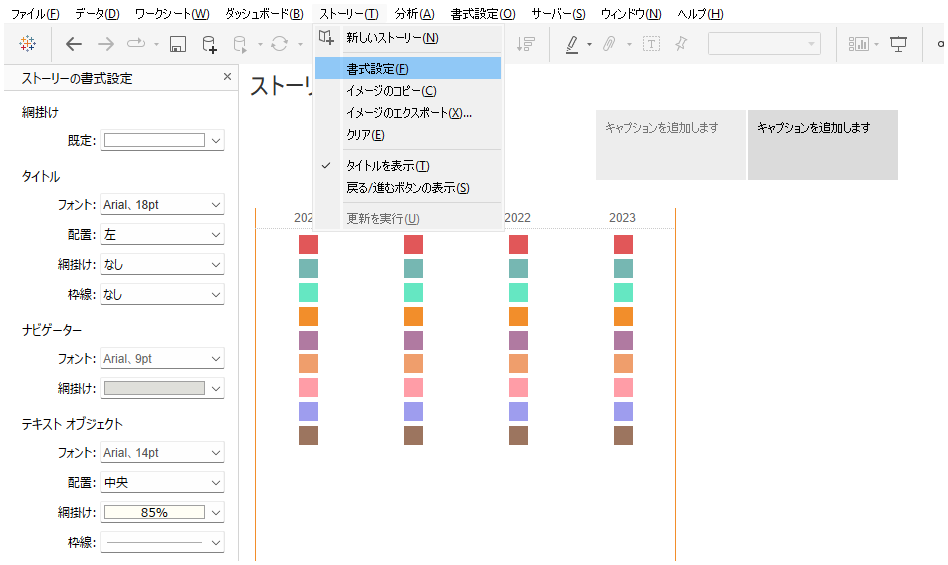
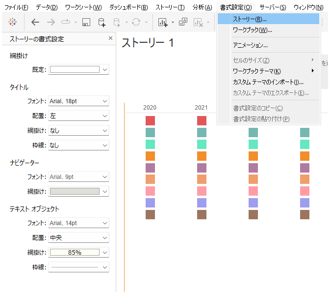

## 機能差異
ストーリーフォーマット機能は、Tableau Desktopでのみ利用可能です。

- **Desktop**: ストーリーの詳細なフォーマット設定が可能
- **Cloud**: ストーリーの基本的な作成は可能だが、高度なフォーマット機能は利用不可

## 使用方法
### Tableau Desktop
1. ストーリータブを作成または選択します
2. ストーリー用のフォーマットメニューにアクセスします
3. 様々なフォーマットオプションを設定できます

### Tableau Cloud
1. ストーリータブの基本的な作成は可能です
2. ただし、高度なフォーマット機能は利用できません

## 使用例・活用場面
- プレゼンテーション用の高品質なストーリーボードの作成
- ブランドガイドラインに合わせたストーリーのデザイン調整
- より視覚的に魅力的なストーリーテリングの実現

## 注意事項・考慮点
- Desktopで作成したフォーマット設定は、Cloudでは完全には再現されない場合があります
- 高度なストーリーフォーマットが必要な場合は、Desktop環境での作業を推奨します
- 将来的にCloud環境でも同等の機能が提供される可能性があります

---
参考: [GitHub Issue #65](https://github.com/mickitty0511/tableau-feature-parity/issues/65)