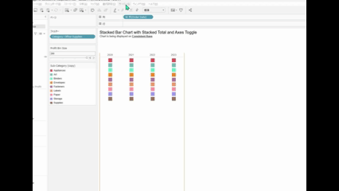

## Feature Differences
User filter settings are only available in Tableau Desktop.

- **Desktop**: User filter functionality is available, allowing customization of personal data views.
- **Cloud**: User filter settings functionality is not available.

## Usage Instructions
### Tableau Desktop
1. Create a filter in a worksheet.
2. Right-click the filter card and select "Customize Filter".
3. Select the "User Filter" tab.
4. Configure user filter settings to create personalized data views.

### Tableau Cloud
User filter settings functionality is not available in Tableau Cloud.

## Use Cases and Applications
- **Personalized Dashboards**: Configure filters so each user only sees data relevant to them
- **Department-based Data Access**: Display only appropriate data based on user's department affiliation
- **Regional Reports**: Automatic data filtering according to user's assigned region

## Notes and Considerations
- This functionality is only available in Tableau Desktop.
- User filters will work on Tableau Server/Cloud when published, but the configuration itself must be done in Desktop.
- Effective use of user filters requires proper user permissions and data source configuration.
- Whether Cloud support is planned for future updates is undetermined.

---
Reference: [GitHub Issue #67](https://github.com/mickitty0511/tableau-feature-parity/issues/67)