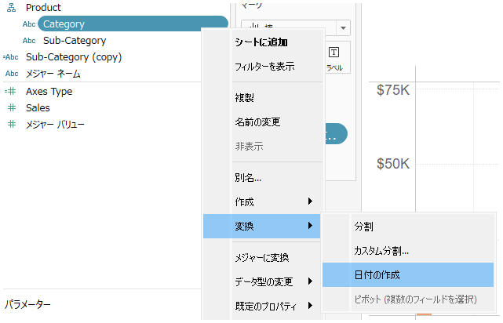

## 機能の違い
データソースパネルの文字列フィールドで使用できるコンテキストメニューは、Tableau Desktop でのみ利用可能です。

- **Desktop**: 文字列フィールドを右クリックした際に、様々なコンテキストメニューオプションが表示されます
- **Cloud**: 文字列フィールドのコンテキストメニューは基本的なオプションのみが利用可能です

## 使用方法
### Tableau Desktop の場合
1. データソースパネルで文字列フィールドを選択します
2. フィールドを右クリックしてコンテキストメニューを表示します
3. 表示される拡張されたメニューオプションから必要な操作を選択します

Desktop の例：

### Tableau Cloud の場合
1. データソースパネルで文字列フィールドを選択します
2. フィールドを右クリックしてコンテキストメニューを表示します
3. 基本的なメニューオプションのみが利用可能です

Cloud の例：

## 使用例・活用場面
- **データ型の変更**: フィールドのデータ型を変更する際に Desktop では豊富なオプションが利用できます
- **フィールドの設定**: フィールドの属性や設定を変更する際に、Desktop でより多くの選択肢があります
- **データの操作**: 文字列フィールドに対する様々な操作が Desktop で可能です

## 注意点・考慮事項
- Desktop では文字列フィールドに対してより多くのコンテキストメニューオプションが利用できます
- Cloud では基本的なオプションのみが提供されており、一部の高度な操作は利用できません
- 複雑なデータ操作を行う場合は、Desktop の使用を検討してください
- 今後のアップデートで Cloud でも機能が拡張される可能性があります

---
参考: [GitHub Issue #56](https://github.com/mickitty0511/tableau-feature-parity/issues/56)