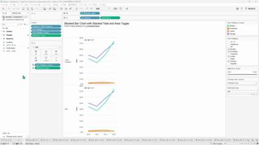
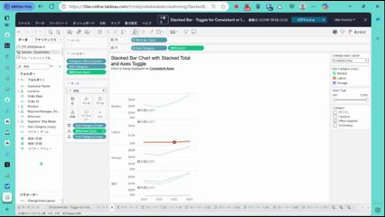

## 機能の違い
データペインの空白エリアでのコンテキストメニューは、Tableau Desktopでのみ利用可能です。

- **Desktop**: データペインの空白エリアを右クリックすることで、様々なコンテキストメニューオプションにアクセスできます。
- **Cloud**: データペインの空白エリアを右クリックしても、コンテキストメニューは表示されません。

## 使用方法
### Tableau Desktop
1. データペインの空白エリア（フィールドが配置されていない部分）を右クリックします。
2. コンテキストメニューが表示され、利用可能なオプションを選択できます。

Desktop例：

### Tableau Cloud
1. データペインの空白エリアを右クリックしても、コンテキストメニューは表示されません。
2. この機能はCloudでは利用できません。

Cloud例：

## 注意事項
- Desktopでは、データペインの空白エリアでコンテキストメニューを利用してデータソースの管理や設定を行うことができます。
- Cloudでは現在この機能は実装されていません。
- 具体的なメニューオプションや使用例については、今後詳細を追加予定です。

---
参考: [GitHub Issue #57](https://github.com/mickitty0511/tableau-feature-parity/issues/57)