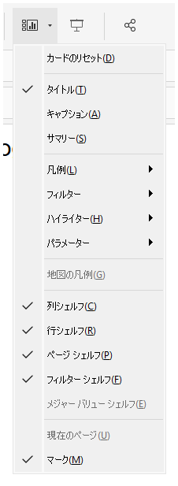
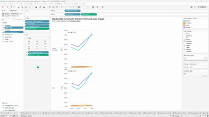
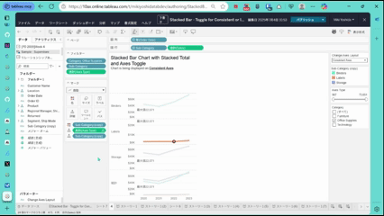

## 機能の違い
ワークシートの空白部分でのコンテキストメニューによる棚、凡例、パラメーター、キャプション、サマリーの表示切り替え機能は、Tableau Desktopでのみ利用可能です。

- **Desktop**: ワークシートの空白エリアを右クリックすることで、棚（行・列・フィルター・ページ）、凡例、パラメーター、キャプション、サマリーなどの表示/非表示を素早く切り替えることができます。
- **Cloud**: ワークシートの空白部分を右クリックしても、これらの表示切り替えオプションは表示されません。

## 使い方
### Tableau Desktopでの操作手順
1. Tableau Desktopでワークシートを開きます。
2. ワークシートの空白部分（ビューの外側の空白エリア）を右クリックします。
3. 表示されるコンテキストメニューから以下の要素の表示/非表示を切り替えできます：
   - 棚（行、列、フィルター、ページ）
   - 凡例
   - パラメーター
   - キャプション
   - サマリー
   - その他のワークシート要素

### Tableau Cloudでの制限
- ワークシートの空白部分を右クリックしてもコンテキストメニューは表示されません。
- 同様の表示切り替えを行う場合は、メニューバーやツールバーから個別に操作する必要があります。

## 利用例
- **レイアウト調整**: ダッシュボード作成時に不要な要素を素早く非表示にしたい場合
- **プレゼンテーション準備**: 発表用にワークシートをクリーンアップする際に、一箇所から複数の要素を制御したい場合
- **画面スペースの最適化**: 小さなモニターや狭いスペースで作業する際に、必要な要素のみ表示したい場合
- **ワークフローの効率化**: 右クリック一つで複数の表示設定にアクセスできるため、作業効率が大幅に向上します

## スクリーンショット
### Tableau Desktop
ワークシートの空白部分のコンテキストメニューオプション：

ワークシートの表示切り替えのデモ：

### Tableau Cloud

## 備考と注意点
- この機能はTableau Desktopでのみ利用可能で、Tableau Cloudでは提供されていません。
- Cloudユーザーは、各要素の表示切り替えを行う際に、メニューバーの「ワークシート」タブやツールバーから個別にアクセスする必要があります。
- この機能により、Desktopでは作業効率が大幅に向上し、ワークシート要素の管理が容易になります。
- DesktopからCloudに移行する際に、この便利なショートカット機能が使えなくなることを考慮する必要があります。
- 今後Cloudでもこのようなコンテキストメニューがサポートされるかどうかは未定です。

---
参考: [GitHub Issue #58](https://github.com/mickitty0511/tableau-feature-parity/issues/58)