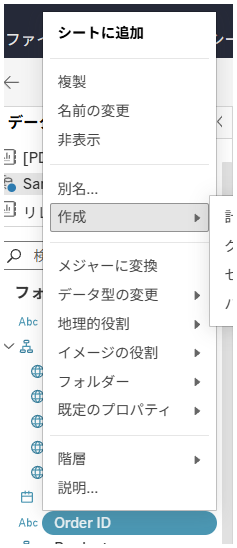

## Feature Differences
Context menu options available for string fields in the Data Source panel are only available in Tableau Desktop.

- **Desktop**: When you right-click on a string field, "Convert" options are displayed with various transformation options
- **Cloud**: String field context menus do not include conversion options

## Usage Instructions
### Tableau Desktop
1. Right-click on a string field in the Data Pane
2. Select "Convert" from the displayed context menu to access various options such as "Date Conversion" (to convert strings to dates), "Split" and "Custom" (to split string data by delimiters)

Desktop example:

### Tableau Cloud
1. Right-click on a string field in the Data Pane
2. The displayed context menu does not include "Convert" options

Cloud example:

## Use Cases and Applications
- **Extract needed data from string data with one click**: Can be executed without creating calculated fields from scratch. Tableau automatically analyzes data patterns and executes transformations.

---
Reference: [GitHub Issue #56](https://github.com/mickitty0511/tableau-feature-parity/issues/56)