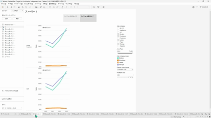
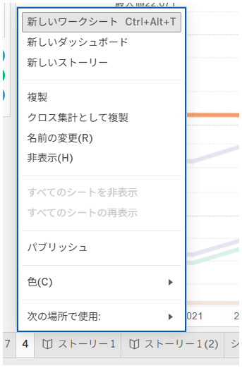

## 機能の違い
他のワークブックからワークシートをコピー・貼り付けする機能は、Tableau Desktopでのみ利用可能です。

- **Desktop**: 他のワークブックからワークシートを選択してコピー・貼り付けが可能
- **Cloud**: この機能は利用できません

## 使用方法
### Tableau Desktop
1. ソース（コピー元）のワークブックを開きます
2. コピーしたいワークシートのタブを右クリックします
3. コンテキストメニューから「コピー」を選択します
4. ターゲット（コピー先）のワークブックを開きます
5. ワークシートタブ領域で右クリックし、「貼り付け」を選択します

Desktop例：

### Tableau Cloud
Tableau Cloudでは、ワークシートの右クリックメニューに基本的なオプションのみ表示され、コピー・貼り付け機能は利用できません。

Cloud例：

## 使用例・ユースケース
- テンプレートワークシートを複数のワークブックで再利用したい場合
- 異なるプロジェクト間でワークシートのデザインや設定を共有したい場合
- 既存のワークシートを基に新しいワークブックを効率的に作成したい場合

## 注意事項と考慮点
- この機能はTableau Desktopの運用にとって重要な機能です（operationally-critical）
- コピー・貼り付け時には、データソースの依存関係に注意が必要です
- Tableau Cloudでは代替手段として、ワークブックをダウンロードしてDesktopで編集後、再度アップロードする必要があります
- 将来的にTableau Cloudでこの機能が追加される可能性があります

---
参考: [GitHub Issue #45](https://github.com/mickitty0511/tableau-feature-parity/issues/45)