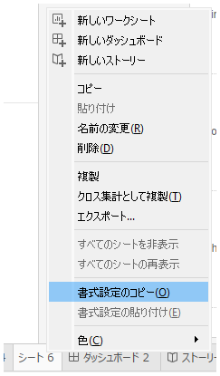
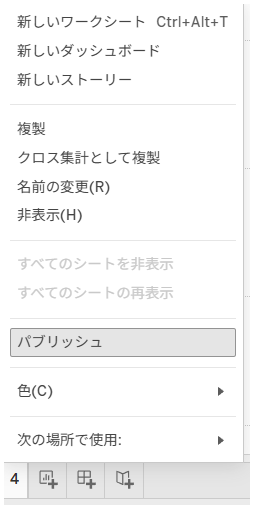

## 機能の違い
ワークシートの書式設定のコピー・貼り付け機能は、Tableau Desktopでのみ利用可能です。

- **Desktop**: ワークシートの書式設定をコピーして、他のワークシートに貼り付けることができます。
- **Cloud**: この機能は利用できません。

## 使用方法
### Tableau Desktop
1. 書式設定をコピーしたいワークシートのタブを右クリックします。
2. コンテキストメニューから「書式設定のコピー」を選択します。

3. 書式設定を適用したいワークシートのタブを右クリックします。
4. 「書式設定の貼り付け」を選択します。

5. 書式設定オプションダイアログが表示されます。適用したい書式設定項目を選択します。

### Tableau Cloud
Tableau Cloudでは、ワークシートタブの右クリックメニューに基本的なオプションのみが表示され、書式設定のコピー・貼り付け機能は利用できません。

## 使用例・活用場面
- **一貫したデザイン作成**: 複数のワークシートで同じフォント、色、レイアウト設定を適用したい場合
- **作業効率向上**: 手動で各ワークシートの書式設定を個別に調整する手間を省き、時間を節約
- **テンプレート作成**: 標準的な書式設定を持つワークシートをテンプレートとして活用

## 注意点・考慮事項
- **Desktop専用機能**: Tableau Cloudでは同様の機能が提供されていないため、Cloud環境での作業では各ワークシートの書式設定を個別に調整する必要があります。
- **運用上重要**: この機能はワークブック編集の効率性に大きく影響するため、運用上重要な機能として分類されています。
- **適用範囲**: フォント、色、軸の設定、グリッドライン、背景色など、様々な書式設定要素をまとめてコピー・貼り付けできます。

---
参考: [GitHub Issue #44](https://github.com/mickitty0511/tableau-feature-parity/issues/44)