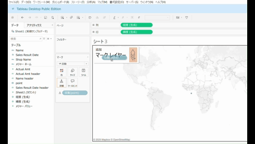
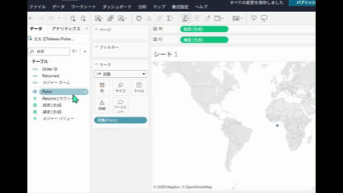

## 機能の違い
マップレイヤーの作成機能は、Tableau Desktopでのみ利用可能です。

- **Desktop**: マップレイヤー機能が利用可能
- **Cloud**: マップレイヤー機能は利用できない

## 使用方法
### Tableau Desktop
1. マップビューを作成します。
2. 「マップ」メニューから「マップレイヤー」を選択します。
3. 背景レイヤー、データレイヤー、リファレンスレイヤーなどの設定が可能です。
4. 各レイヤーの透明度や表示/非表示を調整できます。

Desktopでの例:

### Tableau Cloud
Tableau Cloudでは、マップレイヤーの作成機能は提供されていません。

Cloudでの例:

## 使用例・ユースケース
- 地理的データの多層表示
- 背景地図の種類変更
- カスタムベースマップの利用
- データの地理的文脈の強化

## 注意点・考慮事項
- Tableau Cloudではマップレイヤー機能が利用できないため、Desktop固有の機能となります。
- 複雑なマップレイヤー設定を含むワークブックをCloudに公開する際は、レイヤー設定が適用されない可能性があります。
- 将来的にはCloud側でも同様の機能が提供される可能性があります。

---
参考: [GitHub Issue #70](https://github.com/mickitty0511/tableau-feature-parity/issues/70)