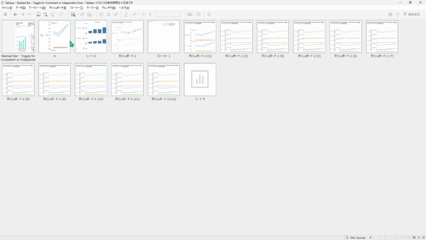

## 機能の違い
Ctrl + ドラッグでシートを複製するショートカットは、Tableau Desktop でのみ利用可能です。

- **Desktop**: Ctrl キーを押しながらシートタブをドラッグすることで、シートを素早く複製できます。
- **Cloud**: このショートカット機能は利用できません。シートの複製は右クリックメニューから行う必要があります。

## 使用方法
### Tableau Desktop の場合
1. 複製したいシートのタブを選択します。
2. Ctrl キーを押したまま、シートタブを別の位置にドラッグします。
3. ドラッグ中に複製アイコンが表示され、ドロップすると新しいシートが作成されます。

### Tableau Cloud の場合
1. 複製したいシートのタブを右クリックします。
2. コンテキストメニューから「複製」を選択します。
3. 新しいシートが作成されます。

## 使用例・ユースケース
- 既存のワークシートをベースに、類似したビューを素早く作成したい場合
- A/Bテスト用に同じシートの異なるバージョンを作成する場合
- ワークシートの設定を保持したまま、データソースや一部の設定のみを変更したい場合

## 注意点・考慮事項
- Desktop では、Ctrl + ドラッグによる直感的なシート複製が可能で、作業効率が向上します。
- Cloud では従来の右クリックメニューによる複製のみサポートされています。
- 複製されたシートは、元のシートの書式設定、フィルター、計算フィールドなどをすべて継承します。
- ショートカットキーによる操作は、特に多数のシートを扱うワークブックで作業効率に大きな差が生まれます。

---
参考: [GitHub Issue #43](https://github.com/mickitty0511/tableau-feature-parity/issues/43)