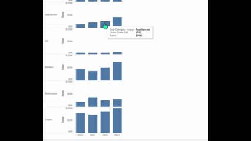

## 機能の違い
ドロップラインは、Tableau Desktopでのみ利用可能です。

- **Desktop**: ドロップライン機能が利用可能で、データポイントから軸への参照線を表示することができます。
- **Cloud**: ドロップライン機能は利用できません。

## 使用方法
### Tableau Desktop
1. ワークシートでチャートを作成します。
2. 「分析」ペインから「ドロップライン」を選択します。
3. ドロップラインをビューにドラッグ&ドロップします。
4. データポイントから軸への参照線が表示されます。

### Tableau Cloud
Tableau Cloudではドロップライン機能は利用できません。

## 使用例・ユースケース
- 散布図でデータポイントの正確な値を軸上で確認したい場合
- 線グラフで特定のポイントのX軸、Y軸の値を明確に表示したい場合
- プレゼンテーション時にデータポイントの位置を強調したい場合

## 注意事項・制限
- この機能は現在Tableau Desktopでのみ利用可能です。
- Tableau Cloudでの対応予定については、今後のアップデートをご確認ください。
- ドロップラインは視覚的な補助として使用され、計算には影響しません。

---
参考: [GitHub Issue #59](https://github.com/mickitty0511/tableau-feature-parity/issues/59)