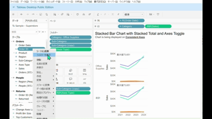
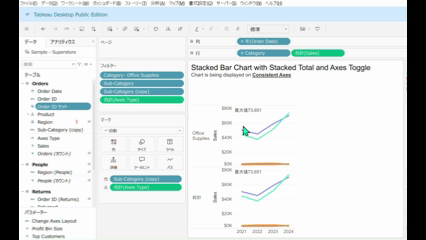
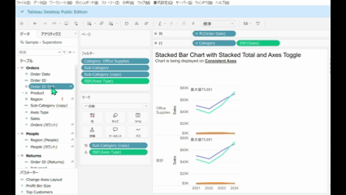
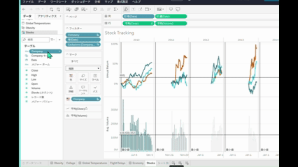
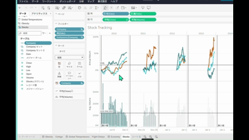

# セットの編集

## 機能の差異

セット編集機能は、Tableau Desktopでのみ利用可能で、Tableau Cloudでは利用できません。

- **Desktop**: メンバーの追加・削除、セットメンバーの表示を含む完全なセット編集機能が利用可能
- **Cloud**: 機能が利用不可

## 使用方法

### Tableau Desktop
1. データペインでセットを右クリックします
2. コンテキストメニューから「編集」を選択してセットを編集できます

3. データ選択後にセットを作成・編集することも可能です

4. 「メンバーの表示」でセットの内容を確認できます

### Tableau Cloud
Tableau Cloudではセット編集機能は利用できません。

## 注意事項と制約

- **Desktop**: セットの作成、編集、メンバーの追加・削除、セット内容の確認が可能です
- **Cloud**: セット編集機能は利用できないため、セットの変更が必要な場合はDesktopで作業する必要があります
- セットを使用したワークブックをCloudで表示・操作することは可能ですが、セット自体の編集はできません

## 参考

[GitHub Issue #86](https://github.com/mickitty0511/tableau-feature-parity/issues/86)