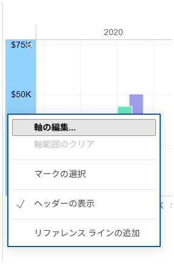

## Feature Differences
The ability to change total and grand total labels from formatting is only available in Tableau Desktop.

- **Desktop**: You can customize total and grand total label text from the axis formatting dialog
- **Cloud**: Only basic formatting menus are available; options to change total and grand total labels are not provided

## Usage Instructions
### Tableau Desktop
1. Right-click on an axis in the view and select "Edit Axis..." from the context menu

2. The axis editing dialog opens, providing access to detailed formatting options for totals and grand totals

3. You can customize the following items:
   - **Axis**: Font, alignment, and number format settings
   - **Totals**: Font, alignment, and number format settings
   - **Grand Totals**: Font, alignment, and number format settings
   - **Special Values**: Display text and mark settings for NULL values

### Tableau Cloud Limitations
1. Right-clicking on axes only displays basic formatting menus

2. Detailed customization options for totals and grand totals are not available

## Use Cases and Applications
- **Report Appearance Enhancement**: Increase font size for total rows to emphasize them
- **Multi-language Support**: Change "Total" and "Grand Total" labels to other languages
- **Branding**: Apply font settings that align with corporate formatting guidelines
- **Number Format Consistency**: Apply different number formats to total rows only (e.g., K unit display)

## Notes and Considerations
- **Desktop-only Feature**: This detailed formatting feature is currently only available in Desktop
- **Retention on Publish**: Formatting set in Desktop is retained after publishing to Cloud
- **Editing Limitations**: These detailed settings cannot be changed in Cloud once published
- **Operational Impact**: For reports where total and grand total display formats are important, pre-configuration in Desktop is essential

## Additional Notes
This feature is classified as operationally-critical and may significantly impact workbook editing functionality. It plays an important role in report completeness and visual consistency.

---
Reference: [GitHub Issue #46](https://github.com/mickitty0511/tableau-feature-parity/issues/46)