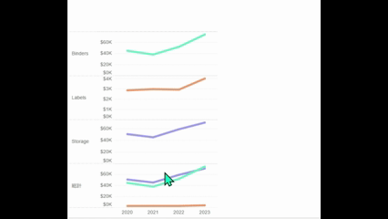

## Feature Differences
Drop lines are only available in Tableau Desktop.

- **Desktop**: Drop line functionality is available, allowing you to display reference lines from data points to axes.
- **Cloud**: Drop line functionality is not available.

## Usage Instructions
### Tableau Desktop
1. Create a chart in a worksheet.
2. Select "Drop Lines" from the "Analytics" pane.
3. Drag and drop drop lines to the view.
4. Reference lines from data points to axes are displayed.

### Tableau Cloud
Drop line functionality is not available in Tableau Cloud.

## Use Cases
- When you want to check exact values of data points on axes in scatter plots
- When you want to clearly display X-axis and Y-axis values for specific points in line charts
- When you want to emphasize data point positions during presentations

## Notes and Limitations
- This feature is currently only available in Tableau Desktop.
- For future Cloud support, please check upcoming updates.
- Drop lines are used as visual aids and do not affect calculations.

---
Reference: [GitHub Issue #59](https://github.com/mickitty0511/tableau-feature-parity/issues/59)