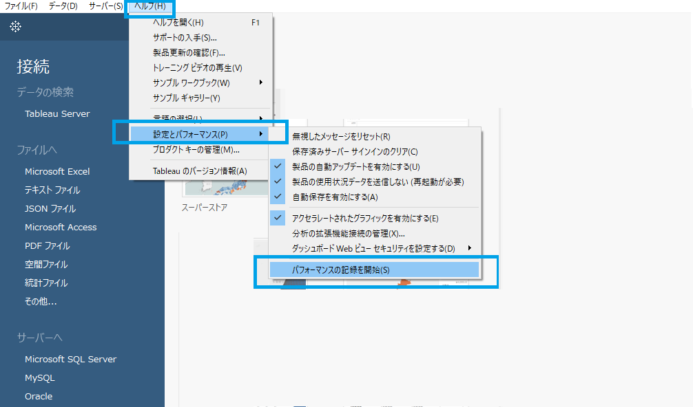

# パフォーマンス記録

## 機能の差異

パフォーマンス記録機能は、Tableau Desktopでのみ利用可能で、Tableau Cloudでは利用できません。

- **Desktop**: ヘルプメニューからパフォーマンス記録機能が利用可能
- **Cloud**: 機能が利用不可

## 使用方法

### Tableau Desktop
1. ヘルプメニューを開きます
2. 「パフォーマンス記録」を選択してパフォーマンス記録を開始します
3. 記録を停止すると、パフォーマンスデータが表示されます

### Tableau Cloud
Tableau Cloudではパフォーマンス記録機能は利用できません。

## 注意事項と制約

- **Desktop**: パフォーマンス記録機能により、ワークブックのパフォーマンスを詳細に分析できます
- **Cloud**: この機能はサーバー環境の制約により利用できません
- パフォーマンス分析が必要な場合は、Tableau Desktopを使用してください

## 参考

[GitHub Issue #84](https://github.com/mickitty0511/tableau-feature-parity/issues/84)