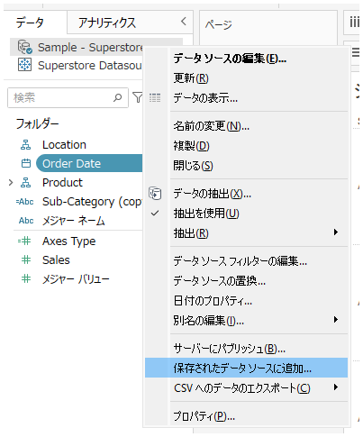

## 機能の違い
接続されたデータソースから全データをローカルCSVまたはHyperファイルにエクスポートする機能は、Tableau Desktopでのみ利用可能です。

- **Desktop**: データソースから全データをCSVまたはHyperファイルとしてローカルにエクスポート可能
- **Cloud**: この機能は利用不可

## 使用手順

### Tableau Desktop
1. データペインでデータソースを右クリックします
2. コンテキストメニューから「データのエクスポート」を選択します
3. エクスポートオプションダイアログで出力形式（CSVまたはHyper）を選択します
4. 保存先を指定してエクスポートを実行します

**Desktop での使用例:**

*データソースの右クリックメニューからデータのエクスポートを選択*

*CSVまたはHyperファイルでのエクスポートオプション*

### Tableau Cloud
1. データソースを右クリックします
2. 基本的なコンテキストメニューのみ表示され、データのエクスポート機能は利用できません

**Cloud での表示例:**

*Cloudでは基本的なメニューのみで、データエクスポート機能は利用不可*

## 使用例・活用場面
- **データの外部共有**: 接続されたデータソースの全データを外部システムやチームメンバーと共有する場合
- **バックアップ作成**: 重要なデータソースのローカルバックアップを作成する場合
- **データ移行**: 異なる環境やシステムへのデータ移行を行う場合
- **分析環境の統一**: チーム全体で同じデータセットを使用して分析を行う場合

## 注意点・考慮事項
- この機能はTableau Desktopの専用機能です
- エクスポート可能なデータ量には制限がある場合があります
- 大容量データのエクスポートには時間がかかる場合があります
- データの機密性を考慮し、エクスポート先やアクセス権限を適切に管理してください
- Hyperファイル形式でエクスポートすると、Tableauでの再利用時にパフォーマンスが向上します

---
参考: [GitHub Issue #60](https://github.com/mickitty0511/tableau-feature-parity/issues/60)