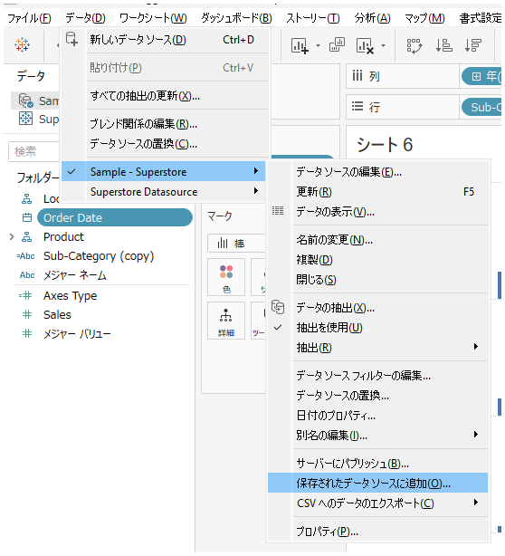
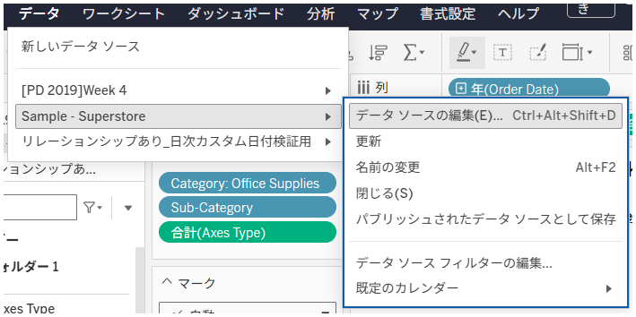

## Feature Differences
The ability to export all data from connected data sources to local CSV or Hyper files is only available in Tableau Desktop.

- **Desktop**: You can export all data from data sources as CSV or Hyper files locally
- **Cloud**: This feature is not available

## Usage Instructions

### Tableau Desktop
1. Right-click on a data source in the data pane
2. Select "Export Data" from the context menu
3. Select the output format (CSV or Hyper) in the export options dialog
4. Specify the save location and execute the export

**Desktop Usage Example:**

*Select export data from the data source right-click menu*

*Export options for CSV or Hyper files*

### Tableau Cloud
1. Right-click on a data source
2. Only basic context menus are displayed, and data export functionality is not available

**Cloud Display Example:**

*Cloud only shows basic menus, data export functionality is unavailable*

## Use Cases and Applications
- **External Data Sharing**: When sharing all data from connected data sources with external systems or team members
- **Backup Creation**: When creating local backups of important data sources
- **Data Migration**: When performing data migration to different environments or systems
- **Unified Analysis Environment**: When the entire team needs to use the same dataset for analysis

## Notes and Considerations
- This feature is exclusive to Tableau Desktop
- There may be limits on the amount of data that can be exported
- Large data exports may take considerable time
- Consider data confidentiality and properly manage export destinations and access permissions
- Exporting in Hyper file format improves performance when reusing in Tableau

---
Reference: [GitHub Issue #60](https://github.com/mickitty0511/tableau-feature-parity/issues/60)