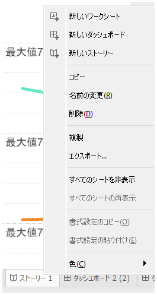
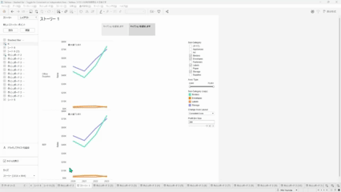

## 機能の違い
単一シートをワークブックファイルとしてエクスポートする機能は、Tableau Desktopでのみ利用可能です。

- **Desktop**: シートの右クリックメニューから単一シートをワークブックファイル（.twbx）としてエクスポートできます。
- **Cloud**: この機能は利用できません。

## 使用方法
### Tableau Desktopでの手順
1. エクスポートしたいシートのタブを右クリックします。
2. コンテキストメニューから「ワークブックにエクスポート」を選択します。

3. ファイル保存ダイアログが表示されるので、保存場所とファイル名を指定します。
4. 「保存」ボタンをクリックして、単一シートを含むワークブックファイルを作成します。

### Tableau Cloudでの状況
Tableau Cloudでは、この機能は提供されていません。シート単位でのワークブックエクスポートはDesktopの専用機能となります。

## 使用例・活用場面
- 複数シートを含む大きなワークブックから、特定のシートのみを他のユーザーと共有したい場合
- プロトタイプとして作成したシートを独立したワークブックとして保存したい場合
- シートのバックアップやアーカイブ目的で単独ファイルとして保存したい場合

## 注意点・考慮事項
- この機能はTableau Desktopでのみ利用可能で、Tableau Cloudでは提供されていません
- エクスポートされるワークブックには、選択したシートとそれに関連するデータソースが含まれます
- エクスポート時には、元のワークブックの書式設定や計算フィールドも保持されます
- エクスポートしたワークブックは独立したファイルとなるため、元のワークブックとの連携は保持されません

---
参考: [GitHub Issue #61](https://github.com/mickitty0511/tableau-feature-parity/issues/61)