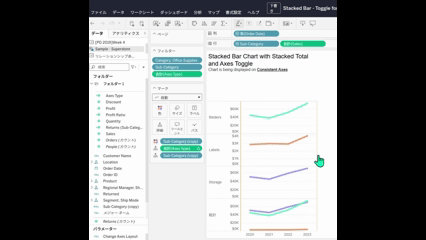

## Feature Differences
Fine cell size adjustment functionality is only available in Tableau Desktop.

- **Desktop**: You can precisely adjust cell sizes with detailed layout control
- **Cloud**: Only basic cell size adjustment is supported

## Usage Instructions
### Tableau Desktop
1. Select the cell you want to adjust in a worksheet or dashboard
2. Position the mouse cursor over the cell border
3. When the cursor changes to a resize icon, drag to finely adjust the size
4. For more precise adjustment, numerical size specification is also possible

### Tableau Cloud
1. Select the cell you want to adjust in a worksheet or dashboard
2. Only basic size adjustment options are available

## Use Cases
- **Precise Dashboard Layout**: Fine adjustments when arranging multiple views
- **Report Creation**: Optimizing appearance for printing or export
- **Presentation Materials**: Creating visually appealing layouts

## Notes and Considerations
- Desktop allows for precise numerical adjustments, while Cloud only provides basic adjustments
- For cases where layout fine-tuning is important, we recommend working in the Desktop environment
- Fine adjustment features may be added to the Cloud environment in the future

---
Reference: [GitHub Issue #38](https://github.com/mickitty0511/tableau-feature-parity/issues/38)