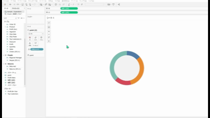

## 機能の違い
セルサイズの細かい調整機能は、Tableau Desktopでのみ利用可能です。

- **Desktop**: セルサイズを精密に調整することができ、レイアウトの細かい制御が可能
- **Cloud**: 基本的なセルサイズ調整のみ対応

## 使用方法
### Tableau Desktop
書式設定 > セルのサイズから以下のオプションおよびショートカットキーが利用可能です。
- より高い
- より低い
- より広い
- より狭い
- より大きい
- より小さい
- 四角形セル
- テキストセル

### Tableau Cloud
1. ワークシートまたはダッシュボードで調整したいセルを選択します
2. 基本的なサイズ調整オプションのみ利用可能です

## 利用例・ユースケース
- **精密なダッシュボードレイアウト**: 複数のビューを配置する際の細かい調整
- **レポート作成**: 印刷やエクスポート時の見た目を最適化
- **プレゼンテーション用資料**: 視覚的に美しいレイアウトの作成

## 注意事項・考慮点
- Desktopでは数値による精密な調整が可能ですが、Cloudでは基本的な調整のみとなります
- レイアウトの微調整が重要な場合は、Desktop環境での作業をお勧めします
- 将来的にはCloud環境でも細かい調整機能が追加される可能性があります

---
参考: [GitHub Issue #38](https://github.com/mickitty0511/tableau-feature-parity/issues/38)