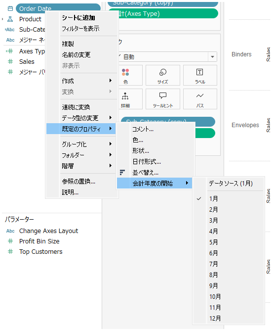

## 機能の違い
会計年度設定は、Tableau Desktopでのみ利用可能です。

- **Desktop**: 会計年度の開始月や関連オプションを設定できます。
- **Cloud**: 会計年度設定の機能は利用できません。

## 使用方法
### Tableau Desktop
1. ワークブックを開いた状態で、メニューバーから「データ」→「データのプロパティ」を選択します。
2. 「基本」タブで、会計年度設定のオプションを確認できます。
3. 会計年度の開始月を選択し、必要に応じて関連する設定を調整します。

### Tableau Cloud
Tableau Cloudでは会計年度設定の機能は提供されていません。

## 利用例・使用事例
- 企業の会計年度が4月始まりの場合、会計年度開始月を4月に設定
- 四半期レポートを会計年度ベースで作成する際の設定
- 年次比較分析において、会計年度に基づいたデータ集計を行う場合

## 注意事項・考慮点
- この機能はTableau Desktopでのみ利用可能で、Tableau Cloudには対応していません。
- 会計年度設定は、ワークブック全体に適用されます。
- 設定変更後は、既存の日付関連の計算や可視化に影響する可能性があります。
- 業務上重要な機能のため、Cloudでの作業時は制限があることを認識しておく必要があります。

---
参考: [GitHub Issue #37](https://github.com/mickitty0511/tableau-feature-parity/issues/37)