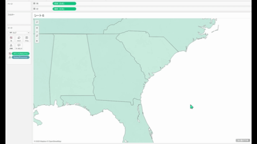
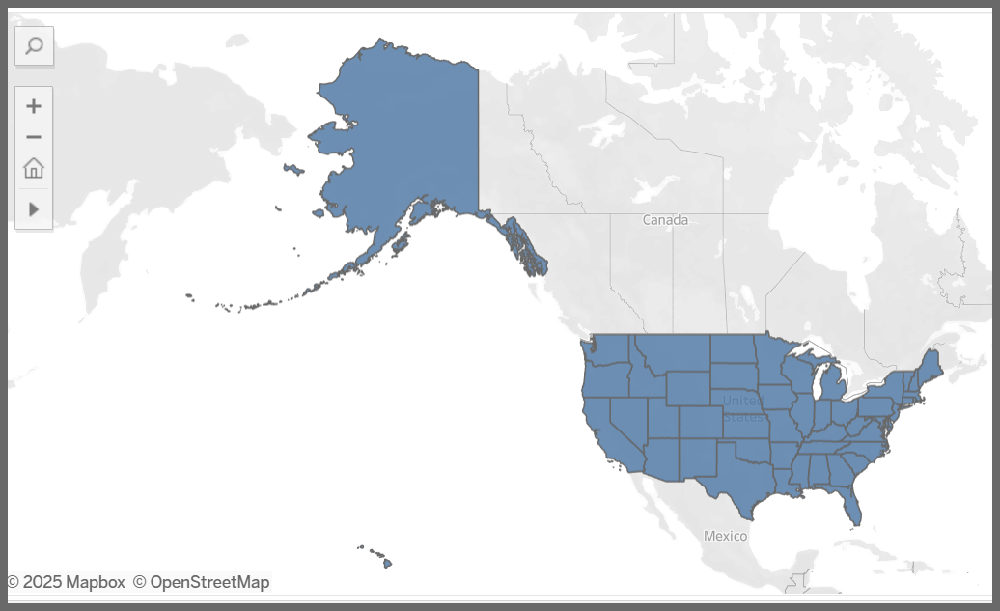

## 機能の違い
デフォルトマップズームの固定機能は、Tableau Desktopでのみ利用可能です。

- **Desktop**: デフォルトマップズームの固定機能が利用可能
- **Cloud**: デフォルトマップズームの固定機能は利用不可

## 使用手順
### Tableau Desktop
1. マップビューを作成します。
2. 目的のズームレベルと表示範囲に調整します。
3. マップを右クリックして「デフォルトマップズームの固定」を選択します。
4. 設定が適用され、今後このワークシートを開く際は固定されたズームレベルで表示されます。

Desktop例:

### Tableau Cloud
Tableau Cloudでは、デフォルトマップズームの固定機能は利用できません。

Cloud例:

## 使用例・活用シーン
- 特定の地域にフォーカスしたマップビューを作成する際
- プレゼンテーション用に一貫したマップ表示を維持したい場合
- ダッシュボードで複数のマップビューの表示範囲を統一したい場合

## 注意事項・制限事項
- この機能はTableau Desktopでのみ利用可能です
- Tableau Cloudではマップのズームレベルを固定することができません
- ワークブックをDesktopからCloudに公開した場合、固定されたズーム設定は維持されません
- 将来のアップデートでCloud版での対応が予定されているかは未定です

---
参考: [GitHub Issue #71](https://github.com/mickitty0511/tableau-feature-parity/issues/71)