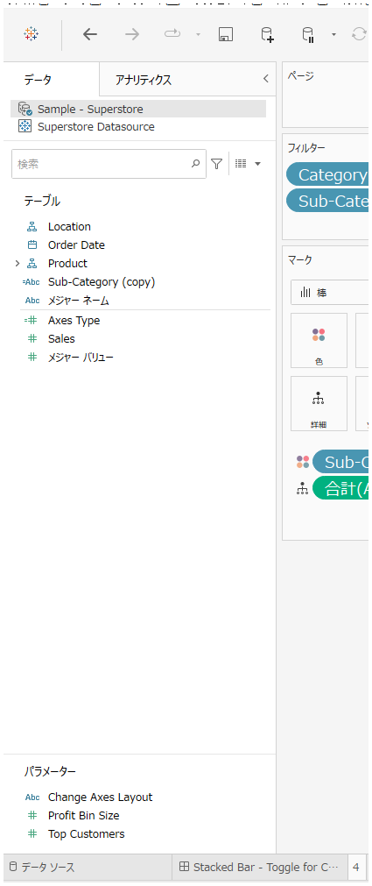
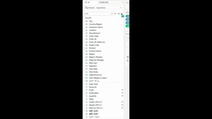

## 機能の違い
データペインで未使用フィールドをすべて非表示にするコマンドは、Tableau Desktopでのみ利用可能です。

- **Desktop**: データペインで右クリックした際のコンテキストメニューから「未使用フィールドを非表示」オプションが使用可能
- **Cloud**: この機能は利用できません

## 使用方法
### Tableau Desktop
1. データペインの任意の場所で右クリックします
2. コンテキストメニューから「未使用フィールドを非表示」を選択します
3. 現在のワークシートで使用されていないフィールドがすべて非表示になります

データペインの状態（全フィールド表示時）:

未使用フィールドを非表示にする操作:

### Tableau Cloud
この機能はTableau Cloudでは利用できません。

## 使用例・活用場面
- **大量のフィールドを含むデータソース**: 多くのフィールドを持つデータソースで、現在使用しているフィールドのみを表示したい場合
- **ワークシートの整理**: 分析作業中にデータペインを整理し、必要なフィールドに集中したい場合
- **プレゼンテーション準備**: デモやプレゼンテーション時に、関連性の高いフィールドのみを表示したい場合

## 注意点・制限事項
- この機能はTableau Desktopでのみ利用可能です
- 非表示にしたフィールドは、データペインの表示設定で再度表示することができます
- ワークシート間でフィールドの表示/非表示設定は独立しています
- この機能により、データペインの管理が容易になり、使用中のフィールドのみを表示できるため、作業効率が向上します

---
参考: [GitHub Issue #36](https://github.com/mickitty0511/tableau-feature-parity/issues/36)