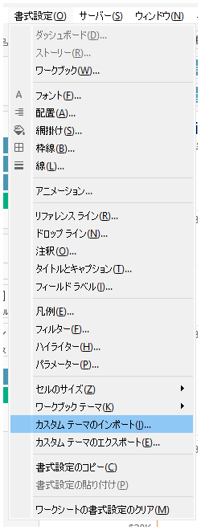

## Feature Differences
The import custom themes functionality is only available in Tableau Desktop (version 2025.1 and later).

- **Desktop**: You can import custom theme files from the formatting menu to apply personalized visualization styles.
- **Cloud**: Custom theme import functionality is not available.

## Usage Instructions
### Tableau Desktop
1. Open a workbook in Tableau Desktop.
2. Click "Format" in the menu bar.
3. Hover over "Workbook Theme".
4. Select "Import Custom Theme...".

5. Select a custom theme file (.tps format) from the file dialog.
6. Once import is complete, the selected custom theme will be applied to the workbook.

### Tableau Cloud Limitations
Tableau Cloud does not provide custom theme import functionality. Only existing built-in themes are available.

## Use Cases and Applications
- **Corporate Branding**: Applying themes that reflect company brand colors and fonts
- **Consistent Design**: Maintaining unified design across multiple workbooks
- **Customized Visualization**: Creating and applying themes specialized for specific purposes or industries

## Notes and Considerations
- This feature is only available in Tableau Desktop 2025.1 and later.
- Custom theme files must be in .tps format.
- Imported themes apply only to that workbook.
- When publishing workbooks to Tableau Cloud, custom theme settings are preserved, but new custom themes cannot be imported.
- This feature may be provided in Tableau Cloud in future versions.

---
Reference: [GitHub Issue #35](https://github.com/mickitty0511/tableau-feature-parity/issues/35)