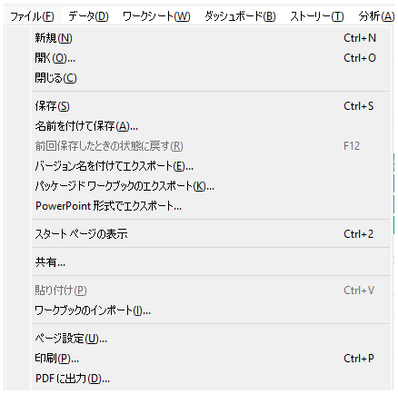
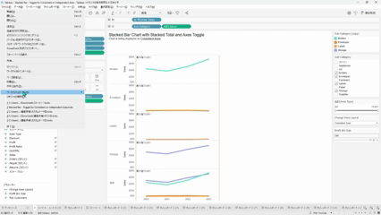

## Feature Differences
The ability to import other workbooks into the current workbook is only available in Tableau Desktop.

- **Desktop**: You can import worksheets, dashboards, and stories from other workbooks into the current workbook.
- **Cloud**: This feature is not available.

## Usage Instructions
### Tableau Desktop
1. Select "File" from the menu bar in the current workbook.
2. Select the "Import" option.
3. Select the workbook file (.twb or .twbx format) you want to import.
4. Select the worksheets, dashboards, and stories to import.
5. Click "OK" to execute the import.

### Tableau Cloud
Tableau Cloud does not provide functionality to directly import other workbooks into the current workbook.

## Use Cases
- **Consolidating Multiple Workbooks**: When combining worksheets created in different projects into one workbook
- **Template Reuse**: When incorporating standard dashboard templates into new workbooks
- **Work Efficiency**: When performing new analysis based on existing worksheets

## Notes and Considerations
- **Data Source Dependencies**: If the imported worksheets reference data sources that don't exist in the current workbook, data source reconfiguration will be necessary.
- **Calculated Field Conflicts**: Name duplication may occur if calculated fields with the same name exist.
- **Format Inheritance**: Formatting settings of imported worksheets are also imported.
- **Work Efficiency Differences**: Since this feature is not available in Cloud, there are significant work efficiency differences between Desktop and Cloud when consolidating multiple workbooks.

## Future Outlook
This feature is important for improving work efficiency in Tableau Cloud, and implementation in the Cloud version is expected in future updates.

---
Reference: [GitHub Issue #34](https://github.com/mickitty0511/tableau-feature-parity/issues/34)