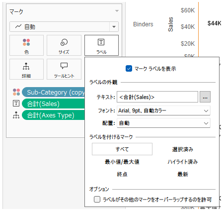
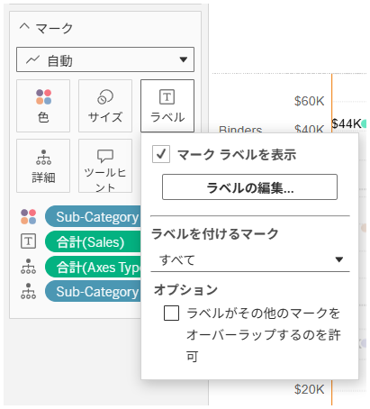

## 機能の違い
ラベルマークのテキスト配置と外観設定は、Tableau Desktopでのみ利用可能です。

- **Desktop**: ラベルマークの詳細なテキスト配置と外観設定が可能
- **Cloud**: 基本的なラベル設定のみ利用可能

## 使用方法
### Tableau Desktopの場合
1. ワークシートでラベルマークを右クリックします
2. 「ラベルの編集」を選択します
3. ラベルダイアログで「配置」や「フォント」などの詳細設定を調整できます
4. テキストの配置、フォントスタイル、サイズ、色などを細かく設定可能です

### Tableau Cloudの場合
1. ワークシートでラベルマークを右クリックします
2. 基本的なラベル設定のみみ利用可能です
3. 詳細なテキスト配置や外観設定は利用できません

## 使用例
### デスクトップでの高度な設定
- テキストの左寄せ、中央寄せ、右寄せ
- フォントファミリーの変更
- フォントサイズの詳細調整
- フォント色とスタイル（太字、斜体など）の設定
- ラベルの背景色と境界線の設定

### クラウドでの制限
- 基本的なラベル表示のオン/オフのみ
- 詳細なフォーマット設定は利用不可

## 注意事項と考慮点
- Desktopでは、ラベルマークの外観を細かく制御できるため、より視覚的に魅力的なダッシュボードを作成できます
- Cloudでは基本的なラベル機能のみ利用可能で、詳細なカスタマイズは制限されています
- この機能差により、Desktopで作成したワークブックをCloudにパブリッシュする際、ラベルの外観が意図した通りに表示されない場合があります
- 運用上重要な機能として分類されており、レポートやダッシュボードの見た目に大きく影響する可能性があります

---
参考: [GitHub Issue #33](https://github.com/mickitty0511/tableau-feature-parity/issues/33)