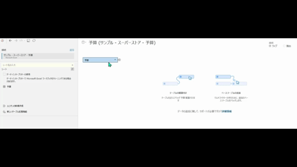
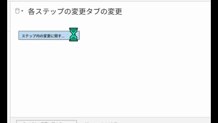

## 機能の違い
ワイルドカードユニオン機能は、Tableau DesktopとTableau Cloudで利用可能性が異なります。

- **Desktop**: パターンマッチングによる複数ファイルの結合が可能な完全なワイルドカードユニオン機能
- **Cloud**: ワイルドカードパターンマッチングなしの基本的なユニオン機能のみ

## 使用方法
### Tableau Desktop
パターンマッチングを使用して複数のファイルを効率的に結合できます：

1. データソースの接続画面で「ユニオン」を選択
2. 「ワイルドカード（自動）」オプションを選択
3. ファイルパターンを指定（例：*.csv、sales_*.xlsx）
4. マッチするファイルが自動的に検出され、結合される

### Tableau Cloud
Cloud環境では、基本的なユニオン機能のみ利用可能です：

## 注意事項
- Desktopでは、同じ構造を持つ複数のファイルを一度に結合でき、データ統合作業が大幅に効率化されます
- ワイルドカード機能により、新しいファイルが追加されても自動的にデータソースに含められます
- Cloudでは、個別にファイルを指定してユニオンを作成する必要があります
- デスクトップ版で作成したワイルドカードユニオンをCloudに移行する際は、データソース構造の見直しが必要です

## 使用例
- 月次レポートファイル（sales_2024_01.csv、sales_2024_02.csv等）の一括結合
- 複数部署からの同形式データファイルの統合
- 時系列データの継続的な追加と自動更新
- ETLプロセスでの複数データソースの統合
- データウェアハウジングにおける複数テーブルの結合

---
参考: [GitHub Issue #80](https://github.com/mickitty0511/tableau-feature-parity/issues/80)