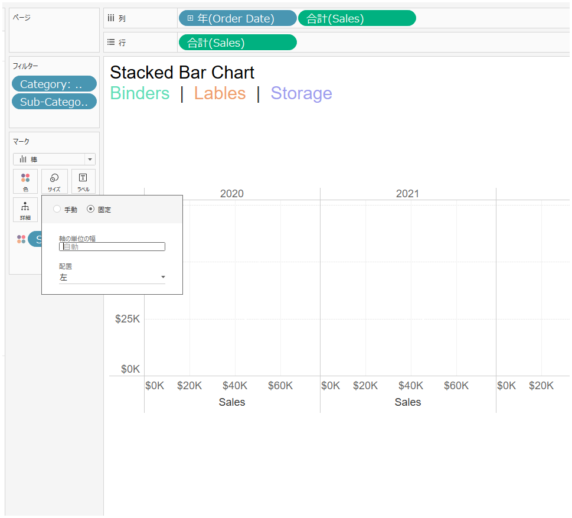
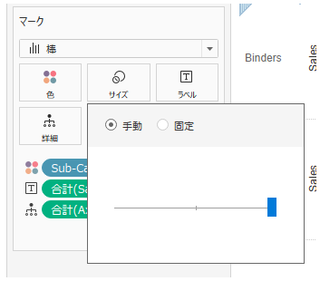

## 機能の違い
行や列に配置されたメジャーフィールドの手動/固定サイズ設定機能は、Tableau Desktopでのみ利用可能です。

- **Desktop**: メジャーフィールドのサイズを手動で調整したり、固定値を設定することができます。
- **Cloud**: この機能は利用できません。

## 使用方法
### Tableau Desktop
1. 行または列にメジャーフィールドを配置します。
2. マークカードで「サイズ」を選択します。

3. 「手動」または「固定」のオプションを選択できます。

4. 具体的な数値を入力してサイズを調整できます。

### Tableau Cloud
Tableau Cloudでは、パーセンテージベースのサイズ調整のみが利用可能で、手動/固定サイズの設定はできません。

## 使用例・活用シーン
- **ダッシュボードレイアウト**: 特定の列幅を固定して、一貫したレイアウトを維持したい場合
- **印刷レポート**: 印刷時の見栄えを調整するために、正確な列幅を指定したい場合
- **データ表示の最適化**: データの内容に応じて、最適な列幅を手動で設定したい場合

## 注意事項・制限事項
- この機能はTableau Desktopでのみ利用可能です。
- Cloudでパーセンテージベースの調整は可能ですが、具体的な数値による固定サイズの設定はできません。
- Desktop作成したワークブックをCloudに公開する際、手動/固定サイズ設定は維持されますが、Cloud上で編集することはできません。

## 将来の計画
現在のところ、Tableau Cloudでこの機能が追加される具体的な予定は発表されていません。

---
参考: [GitHub Issue #31](https://github.com/mickitty0511/tableau-feature-parity/issues/31)