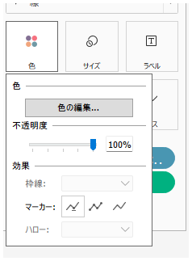
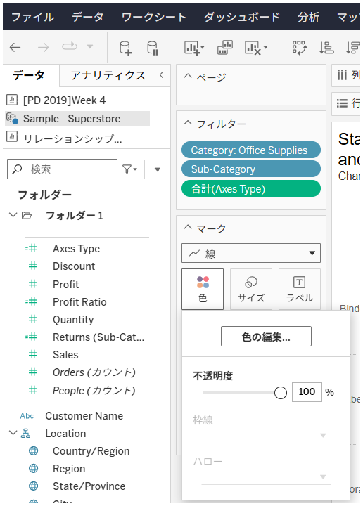

## 機能の違い
折れ線グラフのマーカーオプションは、Tableau Desktopでのみ利用可能です。

- **Desktop**: マークパネルで線の種類やマーカーのスタイルを詳細に設定できます
- **Cloud**: 基本的なマークパネルのみで、マーカーの詳細オプションは利用できません

## 使用方法
### Tableau Desktop
1. 折れ線グラフを作成します
2. マークパネルを確認します
3. 「マーカー」セクションで様々な線のスタイルやマーカーを選択できます
4. 各データポイントに点を表示したり、線の種類を変更したりできます

### Tableau Cloud
1. 折れ線グラフを作成します
2. マークパネルには基本的なオプションのみが表示されます
3. マーカーの詳細設定オプションは利用できません

## 使用例・ユースケース
- **時系列データの可視化**: 各データポイントを明確に表示したい場合
- **トレンドライン分析**: 異なる線のスタイルで複数の系列を区別したい場合
- **プレゼンテーション**: 視覚的に分かりやすい折れ線グラフを作成したい場合

## 注意点・制限事項
- Cloudでは折れ線グラフの基本的な表示は可能ですが、マーカーの詳細カスタマイズはできません
- Desktopで作成したマーカー付きの折れ線グラフをCloudに公開した場合、表示は維持されますが編集はできません
- 運用上重要な機能として分類されており、ワークブック編集機能に影響を与える可能性があります

## 将来の計画
現在のところ、この機能がCloudに追加される具体的な予定は明記されていません。

---
参考: [GitHub Issue #30](https://github.com/mickitty0511/tableau-feature-parity/issues/30)