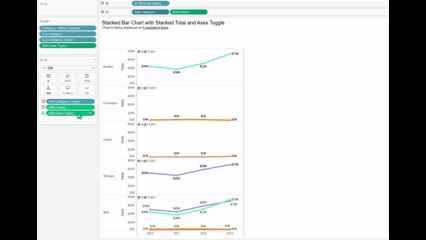
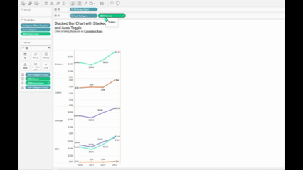

## 機能の違い
行/列/フィルター/マーク棚でのピルの複数選択機能は、Tableau Desktopでのみ利用可能です。

- **Desktop**: 各棚（行、列、フィルター、マーク）でピル（フィールド）を複数選択して、一括操作が可能
- **Cloud**: ピルの複数選択機能は利用できず、単一のピルのみ選択可能

## 使用方法
### Tableau Desktop
1. 行、列、フィルター、またはマーク棚で操作したいピルを確認します
2. CtrlキーまたはShiftキーを押しながら複数のピルをクリックして選択します
3. 選択したピルは視覚的にハイライトされます
4. 複数選択したピルを一括で移動、削除、または他の操作を実行できます

Desktopでの複数選択例:

### Tableau Cloud
1. 行、列、フィルター、またはマーク棚でピルをクリックします
2. 一度に選択できるのは1つのピルのみです
3. 複数のピルを操作したい場合は、個別に処理する必要があります

Cloudでの単一選択例:

## 使用例・ユースケース
### Desktop環境での活用場面
- 複数のディメンションやメジャーを一括で移動する場合
- 複数のフィールドを同時に削除する場合
- 複数のピルの順序を効率的に変更する場合
- ワークシートの構造を大幅に変更する際の効率化

### Cloud環境での代替手法
- 各ピルを個別に操作する
- ドラッグ&ドロップで一つずつ移動する
- 必要に応じて複数回の操作を実行する

## 注意事項と考慮点
- この機能の違いは、特に複雑なワークシートを作成・編集する際の作業効率に大きく影響します
- Desktop環境では、Ctrlキーとクリック、またはShiftキーとクリックで複数選択が可能です
- Cloud環境では現在のところ、この複数選択機能は提供されていません
- 複数のピルを一度に操作したい場合は、Desktop環境の使用を検討することを推奨します
- この機能差は「operationally-critical」に分類されており、ワークブック編集機能に重要な影響を与える要素です

## 今後の見通し
- Tableau Cloudでのピル複数選択機能の実装については、現時点で公式なアナウンスはありません
- 作業効率を重視する場合は、Desktop環境での編集を推奨します

---
参考: [GitHub Issue #28](https://github.com/mickitty0511/tableau-feature-parity/issues/28)