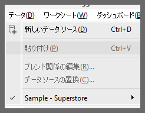
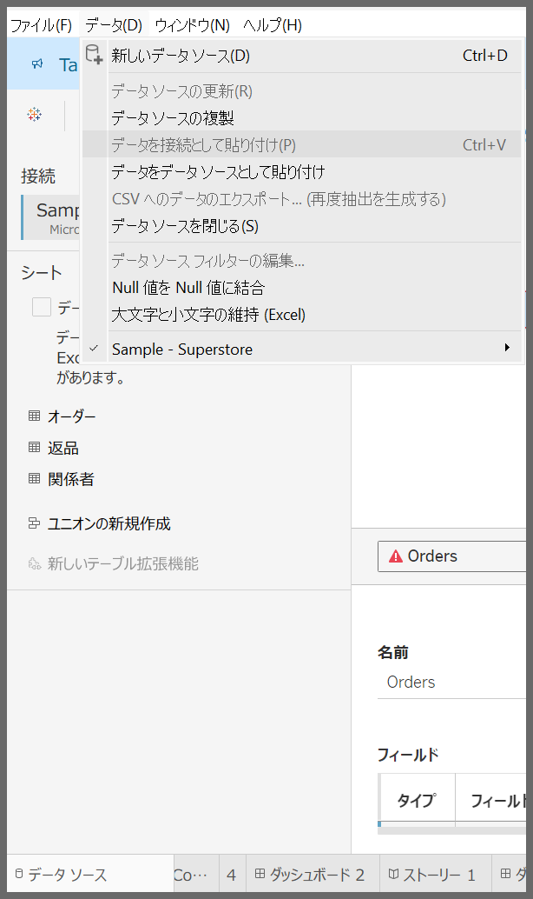
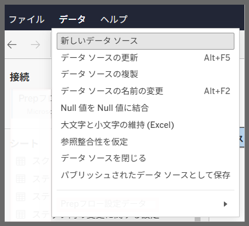
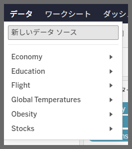

## Feature Differences
The paste datasource functionality availability differs between Tableau Desktop and Tableau Cloud.

- **Desktop**: Full copy and paste capabilities for data sources between workbooks
- **Cloud**: Paste datasource functionality is not available

## Usage Instructions
### Tableau Desktop
You can efficiently copy and paste data sources between workbooks:

1. Right-click on the data source in the source workbook
2. Select "Copy"
3. Open the destination workbook
4. Right-click in the data source pane and select "Paste"

Detailed paste options for data sources:

### Tableau Cloud
In the Cloud environment, data source paste functionality is not available:

## Considerations
- Desktop allows easy sharing and reuse of data sources across multiple workbooks
- In Cloud, data source sharing must be done through other methods (such as using published data sources and upload files)
- When migrating workbooks created on Desktop to Cloud, pay attention to data source paste dependencies

---
Reference: [GitHub Issue #83](https://github.com/mickitty0511/tableau-feature-parity/issues/83)