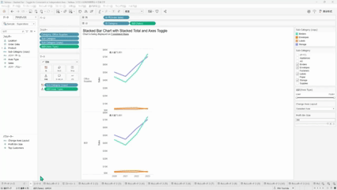
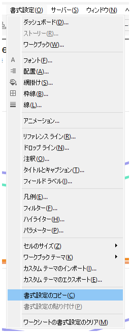

## Feature Differences
The copy and paste worksheet formatting feature is only available in Tableau Desktop.

- **Desktop**: You can copy worksheet formatting and paste it to other worksheets.
- **Cloud**: This feature is not available.

## Usage Instructions
### Tableau Desktop
1. Right-click on the tab of the worksheet whose formatting you want to copy.
2. Select "Copy Formatting" from the context menu.

3. Right-click on the tab of the worksheet where you want to apply the formatting.
4. Select "Paste Formatting".

5. A formatting options dialog appears. Select the formatting items you want to apply.

### Tableau Cloud
In Tableau Cloud, only basic options are displayed in the worksheet tab right-click menu, and copy-paste formatting functionality is not available.

## Use Cases and Applications
- **Consistent Design Creation**: When you want to apply the same fonts, colors, and layout settings across multiple worksheets
- **Improved Work Efficiency**: Save time by avoiding the need to manually adjust formatting settings for each worksheet individually
- **Template Creation**: Use worksheets with standard formatting settings as templates

## Notes and Considerations
- **Desktop-only Feature**: Since similar functionality is not provided in Tableau Cloud, Cloud users need to adjust formatting settings for each worksheet individually
- **Operationally Important**: This feature is classified as operationally critical as it significantly impacts workbook editing efficiency
- **Application Scope**: You can copy and paste various formatting elements including fonts, colors, axis settings, grid lines, background colors, etc.

---
Reference: [GitHub Issue #44](https://github.com/mickitty0511/tableau-feature-parity/issues/44)