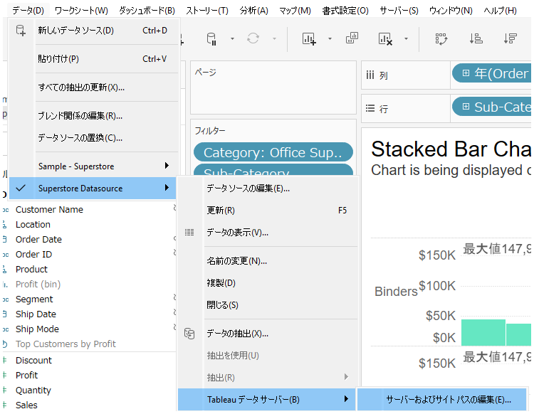

## Feature Differences
The data source replacement command that inherits sort and color settings is only available in Tableau Desktop.

- **Desktop**: When replacing data sources, you can inherit sort order and color settings.
- **Cloud**: This feature is not available.

## Usage Instructions
### Tableau Desktop
1. While using a data source in a workbook, right-click on the data source in the data pane.
2. Select "Replace Data Source" from the context menu.
3. Select the replacement data source.
4. During replacement, existing sort settings and color settings are automatically inherited by the new data source.

### Tableau Cloud
This feature is not available in Tableau Cloud.

## Use Cases and Applications
- When migrating from development to production environments while preserving view settings when switching data sources
- When switching to different data sources with the same structure while maintaining existing color coding and sort settings
- When changing data source connections while preserving dashboard appearance

## Notes and Considerations
- This feature is specific to Tableau Desktop and is not available in Tableau Cloud.
- If field names or structures differ during data source replacement, settings may not be inherited properly.
- For complex calculated fields or hierarchical structures, configuration verification is required after replacement.
- This feature is classified as operationally important and significantly impacts workbook editing functionality.

## Future Outlook
Currently, there is no information about plans for this feature to be supported in Tableau Cloud.

---
Reference: [GitHub Issue #40](https://github.com/mickitty0511/tableau-feature-parity/issues/40)