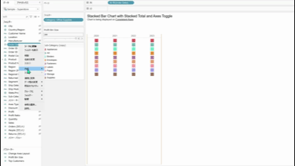

## Feature Differences

The "Replace References" feature that allows batch replacement of fields used in calculated fields and worksheets is only available in Tableau Desktop.

- **Desktop**: The "Replace References" option is available from the context menu when right-clicking on fields in the data pane, allowing you to batch replace all calculated fields and worksheet fields that reference that field with another field.
- **Cloud**: This feature is not available. Only basic context menus are displayed.

## Usage Instructions

### Tableau Desktop Usage

1. Right-click on the field you want to replace in the data pane.
2. Select "Replace References" from the context menu.

3. Select the replacement field.
4. The replacement is executed, and all calculated fields and worksheets using that field are automatically updated.

### Tableau Cloud Limitations

In Tableau Cloud, the "Replace References" option does not appear when right-clicking on fields. Only basic context menus are available.

## Use Cases and Applications

- **Data Source Changes**: When field names change in new data sources, you can use replace references to update all calculated fields and worksheets at once.
- **Field Consolidation**: Useful when consolidating multiple fields with similar roles into one.
- **Large Workbook Management**: Efficient when you need to change specific fields to other fields in workbooks containing many calculated fields and worksheets.

## Notes and Considerations

- This feature is exclusive to Tableau Desktop.
- Batch replacement cannot be undone, so it's recommended to backup the workbook before execution.
- If the source field and replacement field have different data types, it may affect calculation results.
- This is an operationally important feature as it enables efficient updating of multiple calculated fields and worksheets.

---
Reference: [GitHub Issue #27](https://github.com/mickitty0511/tableau-feature-parity/issues/27)