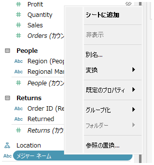
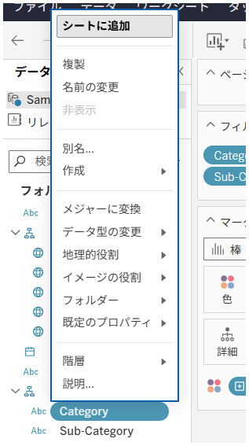

## 機能の違い

計算フィールドやワークシートで使用されるフィールドを一括置換できる「参照の置換」機能は、Tableau Desktop でのみ利用可能です。

- **Desktop**: データペインのフィールドを右クリックしたコンテキストメニューから「参照の置換」オプションが利用でき、そのフィールドを参照している全ての計算フィールドやワークシートのフィールドを一括で別のフィールドに置き換えることができます。
- **Cloud**: この機能は利用できません。基本的なコンテキストメニューのみが表示されます。

## 使用方法

### Tableau Desktop での使用方法

1. データペインで置換したいフィールドを右クリックします。
2. コンテキストメニューから「参照の置換」を選択します。

3. 置換先のフィールドを選択します。
4. 置換が実行され、そのフィールドを使用している全ての計算フィールドとワークシートが自動的に更新されます。

### Tableau Cloud での制限

Tableau Cloud では、フィールドを右クリックしても「参照の置換」オプションは表示されません。基本的なコンテキストメニューのみが利用可能です。

## 使用例・活用方法

- **データソース変更時**: 新しいデータソースでフィールド名が変更された場合、参照の置換を使用して全ての計算フィールドとワークシートを一度に更新できます。
- **フィールド統合**: 似た役割を持つ複数のフィールドを1つに統合する際に活用できます。
- **大規模なワークブック管理**: 多数の計算フィールドやワークシートを含むワークブックで、特定のフィールドを別のフィールドに変更する必要がある場合に効率的です。

## 注意事項と考慮点

- この機能はTableau Desktop専用の機能です。
- 一括置換は元に戻すことができないため、実行前にワークブックのバックアップを取ることを推奨します。
- 置換対象のフィールドと置換先のフィールドのデータ型が異なる場合、計算結果に影響を与える可能性があります。
- 複数の計算フィールドやワークシートを効率的に更新できるため、運用上重要な機能です。

---
参考: [GitHub Issue #27](https://github.com/mickitty0511/tableau-feature-parity/issues/27)