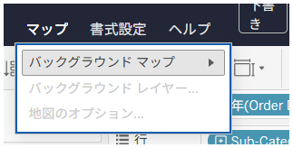

## 機能の違い
リッチマップタブ設定は、Tableau Desktopでのみ利用可能な機能です。

- **Desktop**: 高度なマップカスタマイズのためのリッチマップタブ設定が利用可能
- **Cloud**: リッチマップタブ設定は利用不可（基本的なマップメニューのみ）

## 使用方法
### Tableau Desktop
1. マップビューを作成または選択します。
2. メニューからリッチマップタブ設定にアクセスします。
3. 高度なマップカスタマイズオプションを使用できます。

### Tableau Cloud
1. マップビューを作成または選択します。
2. 基本的なマップメニューのみが利用可能です。

## 使用例・ユースケース
- **高度なマップスタイリング**: Desktopでは詳細なマップ外観の調整が可能
- **カスタムマップレイヤー**: 複数のマップレイヤーの管理と設定
- **地理的データの詳細表示**: より精密な地理的データの可視化設定

## 注意事項と考慮点
- この機能はTableau Desktopでのみ利用可能です
- Cloudではリッチマップタブ設定にアクセスできません
- 高度なマップカスタマイズが必要な場合はDesktopの使用を推奨します
- 運用上重要な機能として分類されています

---
参照: [GitHub Issue #26](https://github.com/mickitty0511/tableau-feature-parity/issues/26)