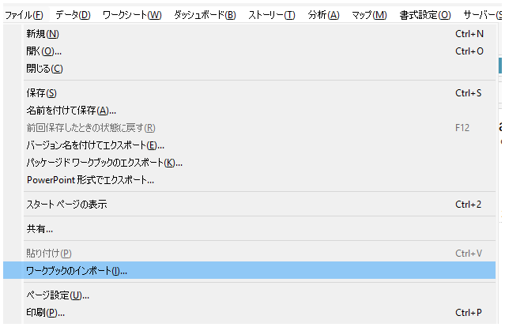
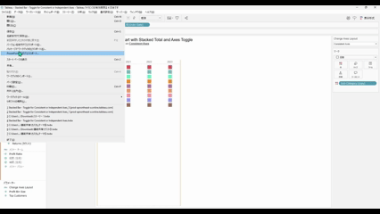

## 機能の違い
ファイルタブからのリッチ印刷オプションは，Tableau Desktopでのみ利用可能です。

- **Desktop**: ファイルタブから詳細な印刷オプションにアクセスでき，高度な印刷設定が可能
- **Cloud**: リッチ印刷オプションは利用できません

## 使用方法
### Tableau Desktop
1. ワークブックを開きます
2. ファイルタブをクリックします
3. 印刷オプションから詳細な設定を選択できます

Desktop例:

### Tableau Cloud
Tableau Cloudでは，ファイルタブからのリッチ印刷オプションは利用できません。基本的な印刷機能のみが提供されます。

## 使用例・用途
- 高解像度での印刷設定
- カスタム用紙サイズの設定
- 印刷レイアウトの詳細な調整
- プロフェッショナルな印刷出力の作成

## 注意事項・制限
- この機能はTableau Desktopでのみ利用可能です
- Tableau Cloudでは基本的な印刷機能のみ提供されます
- 詳細な印刷設定が必要な場合は，Tableau Desktopの使用を検討してください

## 今後の展望
Tableau Cloudでのリッチ印刷オプションの対応については，今後のアップデートで改善される可能性があります。

---
参考: [GitHub Issue #53](https://github.com/mickitty0511/tableau-feature-parity/issues/53)