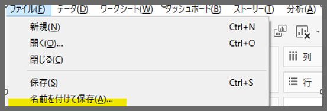
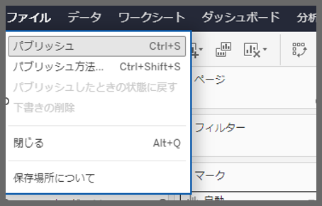

## 機能の違い
「名前を付けて保存」のワークブック機能は、Tableau DesktopとTableau Cloudで利用可能性が異なります。

- **Desktop**: ファイル名の指定と保存場所の選択ができる完全な「名前を付けて保存」機能
- **Cloud**: ファイル保存不可(Cloudの「パブリッシュ形式を変更」は似ていますがパブリッシュ操作となるため、ファイル保存とは異なります)

## 使用方法
### Tableau Desktop
柔軟な保存オプションでワークブックを管理できます：

1. ファイルメニューから「名前を付けて保存」を選択
2. 保存場所とファイル名を指定
3. ファイル形式（.twb、.twbx）を選択
4. 保存ボタンをクリック

### Tableau Cloud
Cloud環境では利用不可

## 注意事項
- Desktopでは、ローカルファイルシステムへの保存、ネットワークドライブへの保存、異なるファイル名での保存が可能
- ワークブックのバージョン管理やバックアップ作成に「名前を付けて保存」が有効

## 使用例
- プロジェクトの異なるバージョンの作成
- テンプレートワークブックからの新規ワークブック作成  
- 開発環境と本番環境での異なるファイル名管理
- 定期的なバックアップファイルの作成
- チーム共有前のローカル作業コピーの保存

---
参考: [GitHub Issue #82](https://github.com/mickitty0511/tableau-feature-parity/issues/82)