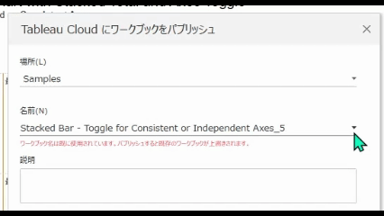
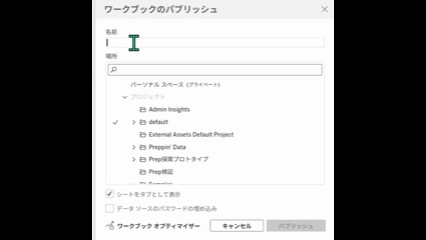

## Feature Differences
The functionality to list and select workbooks in selected projects when publishing (easy overwrite) is only available in Tableau Desktop.

- **Desktop**: The publish dialog displays existing workbooks in the selected project, allowing easy selection of workbooks to overwrite.
- **Cloud**: Only basic publish dialog is available, without the ability to list workbooks within projects.

## Usage Instructions
### Tableau Desktop
1. With a workbook open, select "Server" → "Publish" or "File" → "Publish".
2. Select a project in the publish dialog.
3. A list of existing workbooks in the selected project is displayed.
4. You can select the workbook to overwrite from the list.

### Tableau Cloud
1. With a workbook open, select the publish option.
2. A basic publish dialog is displayed.
3. There is no functionality to list workbooks within projects.

## Use Cases
- Overwrite publishing when multiple workbooks exist in the same project
- Preventing unintended overwrites by confirming and selecting existing workbooks
- Efficient workbook update operations in project management

## Notes and Considerations
- This feature is only available in Tableau Desktop and is operationally important.
- In Cloud, you need to manually enter workbook names or remember existing workbook names.
- Desktop is more efficient when managing workbooks in large-scale projects.
- This feature may be added to Cloud in the future.

## Current Limitations
- Tableau Cloud cannot reference existing workbook lists within projects.
- When overwrite publishing, you need to manually enter exact workbook names.

---
Reference: [GitHub Issue #32](https://github.com/mickitty0511/tableau-feature-parity/issues/32)