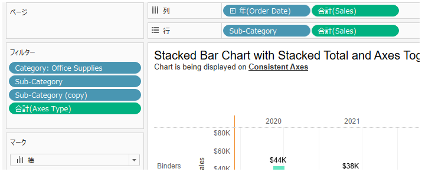
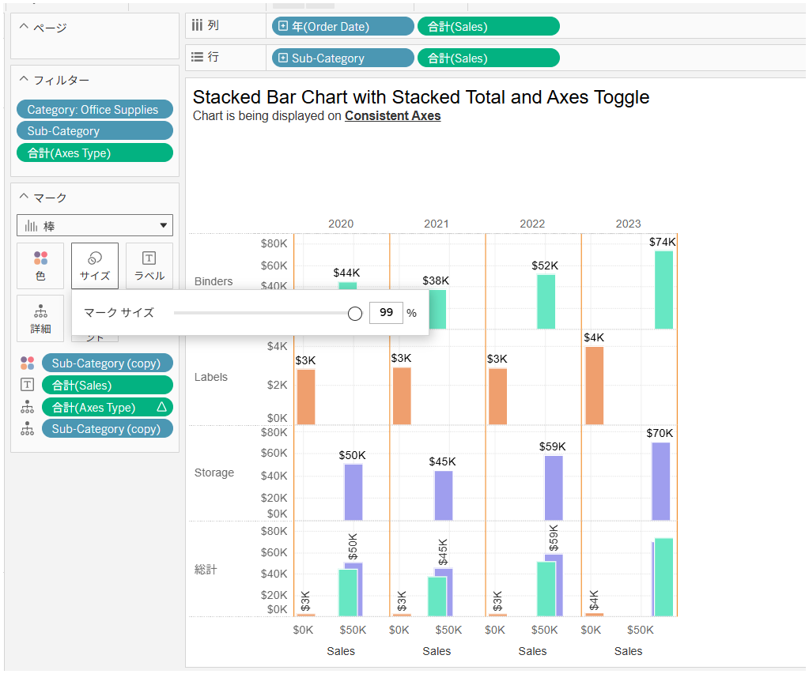

## Feature Differences
Manual/fixed size settings for measure fields placed in rows or columns are only available in Tableau Desktop.

- **Desktop**: You can manually adjust measure field sizes or set fixed values.
- **Cloud**: This feature is not available.

## Usage Instructions
### Tableau Desktop
1. Place measure fields in rows or columns.
2. Select "Size" in the marks card.

3. You can select "Manual" or "Fixed" options.

4. You can enter specific numerical values to adjust the size.

### Tableau Cloud
Tableau Cloud only allows percentage-based size adjustments; manual/fixed size settings are not available.

## Use Cases and Applications
- **Dashboard Layout**: When you want to fix specific column widths to maintain consistent layout
- **Print Reports**: When you want to specify exact column widths to adjust appearance for printing
- **Data Display Optimization**: When you want to manually set optimal column widths according to data content

## Notes and Limitations
- This feature is only available in Tableau Desktop.
- Percentage-based adjustments are possible in Cloud, but fixed size settings with specific numerical values are not available.
- When publishing workbooks created in Desktop to Cloud, manual/fixed size settings are maintained but cannot be edited in Cloud.

## Future Plans
Currently, no specific plans for adding this feature to Tableau Cloud have been announced.

---
Reference: [GitHub Issue #31](https://github.com/mickitty0511/tableau-feature-parity/issues/31)