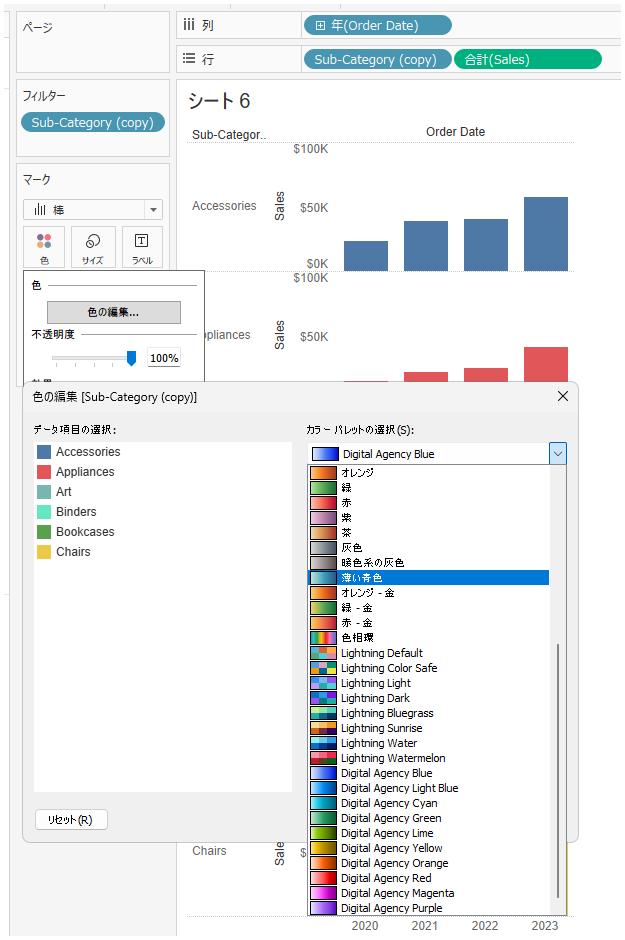
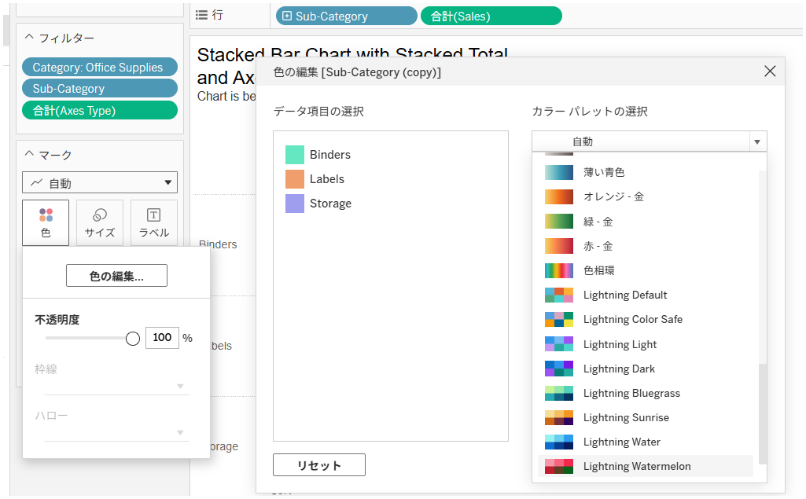

## 機能の違い
カスタムカラーパレットは、Tableau Desktopでのみ利用可能です。

- **Desktop**: ユーザーが独自のカラーパレットを定義し、ビジュアライゼーションで使用することができます。
- **Cloud**: 標準のカラーパレットのみが利用可能で、カスタムパレットの作成や読み込みはできません。

## 使用方法
### Tableau Desktop
1. ワークブック内でカラーマークをクリック
2. 「色の編集」を選択
3. カラーパレットドロップダウンから「Import」を選択してカスタムパレットをインポート、または「New」で新規作成
4. 独自のカラーパレットを定義・保存して使用

### Tableau Cloud
1. ワークブック内でカラーマークをクリック
2. 「色の編集」を選択
3. 標準で提供されているカラーパレットのみ利用可能

## 使用例・活用場面
- **企業ブランドカラーの統一**: 会社の公式カラーを使用したカスタムパレットを作成し、全てのビジュアライゼーションで一貫したブランドイメージを維持
- **業界特有の色使い**: 業界標準やベストプラクティスに基づいたカラーパレットの適用
- **アクセシビリティ対応**: 色覚多様性に配慮したカスタムカラーパレットの使用
- **データの意味に応じた色分け**: 特定のデータ値に対して意味のある色を事前定義

## 注意点・考慮事項
- Tableau Cloudでは現在、標準で提供されているカラーパレットのみが利用可能です。
- Desktopで作成したカスタムパレットを使用したワークブックをCloudにパブリッシュした場合、パレットは保持されますが、Cloud上で新しいカスタムパレットを作成することはできません。
- ワークブック間でのカスタムパレットの共有や管理機能については、今後の改善が期待されます。
- カスタムパレットの作成は、データの視認性や解釈に大きな影響を与えるため、慎重な色選択が重要です。

---
参照: [GitHub Issue #42](https://github.com/mickitty0511/tableau-feature-parity/issues/42)