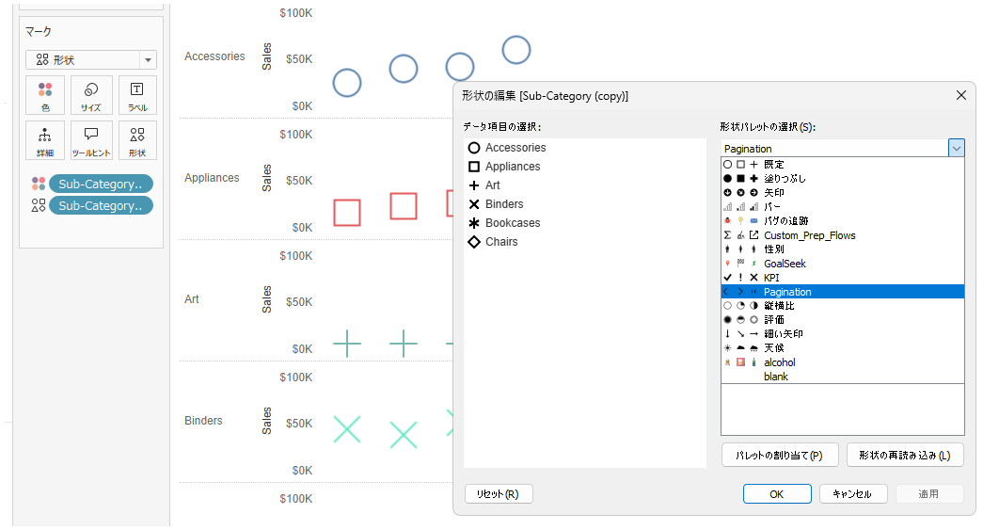
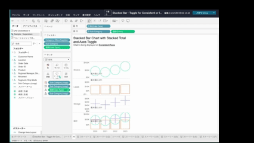

## 機能の違い
カスタムシェイプ機能はTableau Desktopでのみ利用可能です。

- **Desktop**: カスタムシェイプファイルをインポートして独自の図形を可視化に使用可能
- **Cloud**: デフォルトで用意されたシェイプのみ利用可能

## 使用方法
### Tableau Desktop
1. マークパネルでシェイプを選択
2. シェイプパレットから「カスタムシェイプ」オプションを選択
3. 独自のシェイプファイル（.png、.jpg等）をインポート
4. インポートしたシェイプを可視化に適用

### Tableau Cloud  
1. マークパネルでシェイプを選択
2. デフォルトで用意されたシェイプのみが利用可能
3. カスタムシェイプのインポート機能は利用不可

## 使用例・活用場面
- 企業ロゴやアイコンを使った可視化
- 業界固有の図形を使った専門的なダッシュボード
- ブランディングに合わせたカスタマイズされた可視化
- 地図上でのカスタムマーカー表示

## 注意点と制限事項
- カスタムシェイプ機能はDesktopでのみ利用可能
- Cloudではデフォルトシェイプのみが利用可能
- Desktopで作成したカスタムシェイプを使用したワークブックをCloudで表示する場合、シェイプが正しく表示されない可能性がある
- サポートされるファイル形式：PNG、JPEG、GIF、BMP等

## 今後の展望
現在のところ、Cloud環境でのカスタムシェイプサポートに関する具体的な予定は公表されていません。

---
参照: [GitHub Issue #41](https://github.com/mickitty0511/tableau-feature-parity/issues/41)