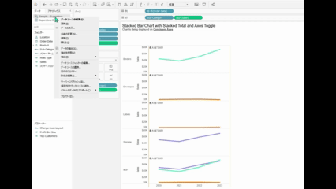
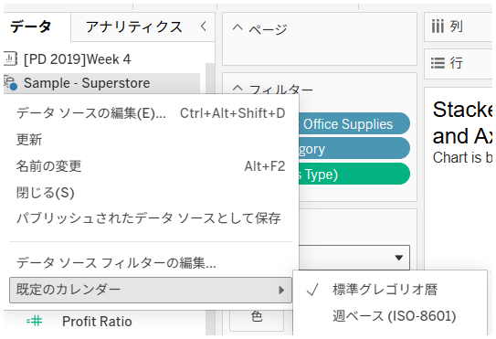

## 機能の違い
日付プロパティからデフォルトの会計年度開始月、週開始日、日付形式を設定できるのは、Tableau Desktopのみです。

## 使用方法
### Tableau Desktop
1. データソースの日付フィールドを右クリックします。
2. 「デフォルトのプロパティ」を選択します。
3. 「日付プロパティ」を選択します。
4. 以下の設定を調整できます：
   - 会計年度開始月
   - 週の開始日
   - 日付形式

### Tableau Cloud
Tableau Cloudでは、基本的な日付形式オプションのみが利用可能で、会計年度開始月や週開始日などの詳細な設定はできません。

## 使用例・ユースケース
- **会計年度レポート**: 4月開始の会計年度など、企業固有の会計年度に合わせたレポート作成
- **週次レポート**: 月曜日開始の週など、組織の業務スケジュールに合わせた週次分析
- **国際化対応**: 地域に応じた日付形式の統一（例：日本形式 YYYY/MM/DD）

## 注意事項と考慮点
- この機能はTableau Desktopでのみ利用可能で、ワークブックをTableau Cloudに公開後は設定を変更できません
- デスクトップで設定した日付プロパティは、公開されたワークブック内で保持されます
- より柔軟な日付処理が必要な場合は、計算フィールドを使用することを検討してください
- 組織全体で統一した日付設定を適用したい場合に特に有用です

---
参考: [GitHub Issue #25](https://github.com/mickitty0511/tableau-feature-parity/issues/25)