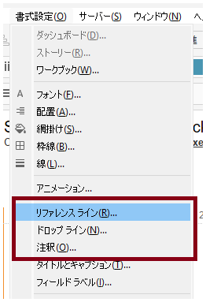
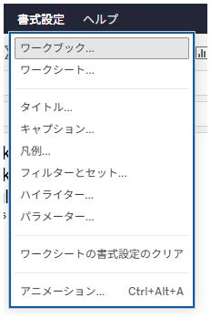

## 機能差異
参考線、注釈、ドロップライン、タイトル、キャプション、フィールドラベルのデフォルト書式設定機能は、Tableau Desktopでのみ利用可能です。

- **Desktop**: これらの要素に対してデフォルトの書式設定を行うことができ、ワークブック全体で一貫した外観を維持できます。
- **Cloud**: デフォルト書式設定機能は利用できず、個別に書式設定を行う必要があります。

## 使用方法
### Tableau Desktopの場合
1. メニューから「書式」→「ワークブック」を選択します。
2. 書式設定ダイアログで各要素（参照線、注釈、ドロップライン、タイトル、キャプション、フィールドラベル）のデフォルト設定を変更できます。
3. 設定した内容は、新しく作成する該当要素に自動的に適用されます。

### Tableau Cloudの場合
1. 各要素を個別に選択して書式設定を行う必要があります。
2. 基本的な書式設定メニューのみが利用可能です。

## 使用例・活用場面
- **企業標準の書式設定**: 会社のブランドガイドラインに合わせて、全てのワークブックで統一された書式設定を適用したい場合
- **効率的なワークブック作成**: 複数のワークシートで同じ書式設定を繰り返し適用する必要がある場合
- **大規模なダッシュボード開発**: 多数の参照線や注釈を含むダッシュボードで、一貫した見た目を維持したい場合

## 注意事項・制限事項
- **Desktop限定機能**: この機能はTableau Desktopでのみ利用可能で、Cloudでは提供されていません。
- **既存要素への影響**: デフォルト書式設定の変更は、新しく作成する要素にのみ適用され、既存の要素には影響しません。
- **要素別設定**: 参照線、注釈、ドロップライン、タイトル、キャプション、フィールドラベルそれぞれに対して個別にデフォルト設定を行う必要があります。
- **Cloudでの代替方法**: Cloudでは各要素を作成後に個別に書式設定を適用する必要があるため、作業効率が低下する可能性があります。

---
参考: [GitHub Issue #24](https://github.com/mickitty0511/tableau-feature-parity/issues/24)