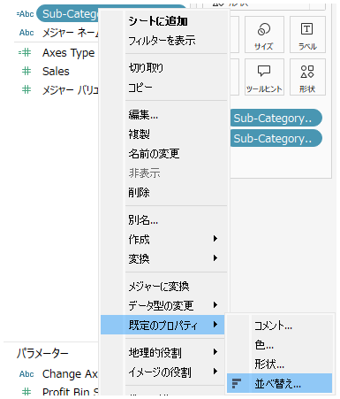
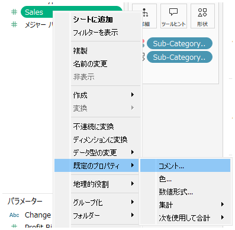
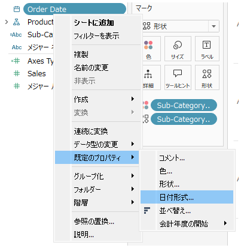
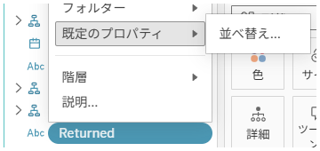
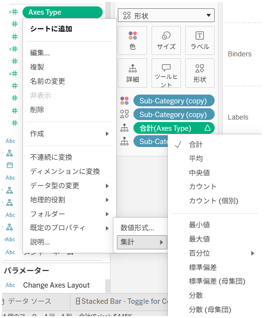
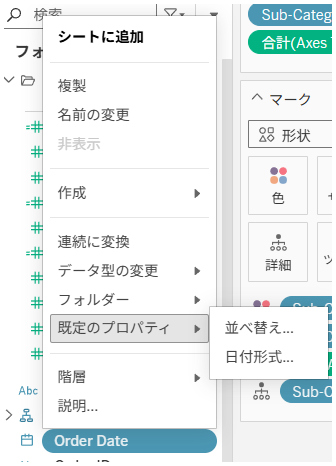

## 機能の違い
フィールドのデフォルトプロパティ設定（色、数値書式、コメント、文字列フィールドの図形、数値フィールドの集計と合計など）は、Tableau Desktopでのみ利用可能です。

- **Desktop**: フィールドのデフォルトプロパティを詳細に設定可能（色、書式、集計方法、図形など）
- **Cloud**: 基本的なフィールドオプションのみ利用可能で、デフォルトプロパティの設定機能は制限的

## 利用方法
### Tableau Desktop
1. データペインでフィールドを右クリックします。
2. 「デフォルトプロパティ」メニューを選択します。

3. サブメニューから設定したいプロパティを選択します（色、数値書式、コメント、集計など）。

4. 選択したプロパティの詳細設定画面で値を設定します。

### Tableau Cloud
1. データペインでフィールドを右クリックします。
2. 基本的なコンテキストメニューのみが表示されます。

3. デフォルトプロパティメニューは利用できません。

4. 利用可能な書式設定オプションは限定的です。

## 利用例・ユースケース
### Tableau Desktop での活用例
- **数値フィールド**: デフォルトの集計方法（合計、平均、カウントなど）を設定
- **文字列フィールド**: デフォルトの図形や色を設定
- **日付フィールド**: デフォルトの書式（年/月/日の表示形式）を設定
- **すべてのフィールド**: コメントを追加してフィールドの説明を記録

### 業務への影響
- ワークブック作成の効率化（毎回同じ設定を繰り返す必要がない）
- チーム間でのフィールド設定の標準化
- データの可視化における一貫性の確保

## 注意事項・考慮点
- Tableau Cloud では現在、フィールドのデフォルトプロパティ設定機能は制限されています
- Desktop で設定したデフォルトプロパティがCloud で完全に反映されない場合があります
- 運用上重要な機能のため、Desktop での事前設定が推奨されます
- 将来的にCloud での機能拡張の可能性があります

## 参考
- [GitHub Issue #39](https://github.com/mickitty0511/tableau-feature-parity/issues/39)