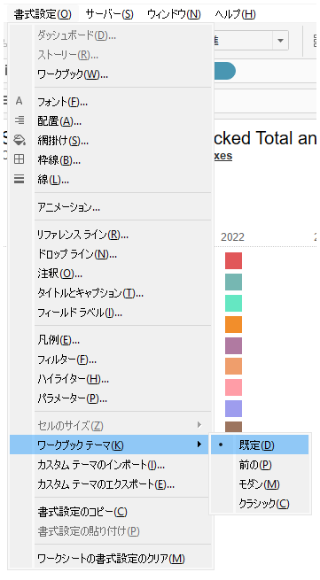

## 機能の違い
書式設定におけるワークブックテーマオプションは、Tableau Desktopでのみ利用可能です。

- **Desktop**: 書式設定でワークブックテーマオプションが利用可能で、一貫したデザインを適用できます。
- **Cloud**: ワークブックテーマオプションは利用できません。

## 使用方法
### Tableau Desktop
1. ワークシートまたはダッシュボードで、書式設定メニューにアクセスします。
2. ワークブックテーマオプションから、プリセットされたテーマを選択します。
3. 選択したテーマがワークブック全体に適用され、一貫したデザインが実現されます。

### Tableau Cloud
1. 書式設定メニューにアクセスします。
2. 基本的な書式設定オプションのみが利用可能で、ワークブックテーマオプションは表示されません。

## 使用例・ユースケース
- **レポートの統一性**: 複数のワークシートやダッシュボードで一貫したデザインを維持する場合
- **プレゼンテーション用**: 視覚的に統一感のあるプレゼンテーション資料を作成する場合

## 注意事項・制限事項
- この機能はTableau Desktopでのみ利用可能で、Tableau Cloudでは提供されていません。
- ワークブックテーマを適用すると、既存の個別の書式設定が上書きされる場合があります。

---
参考: [GitHub Issue #68](https://github.com/mickitty0511/tableau-feature-parity/issues/68)