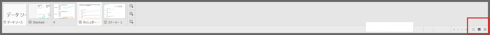
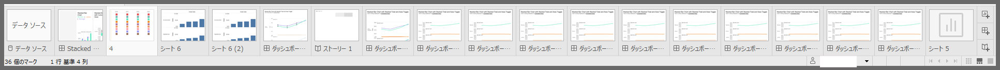
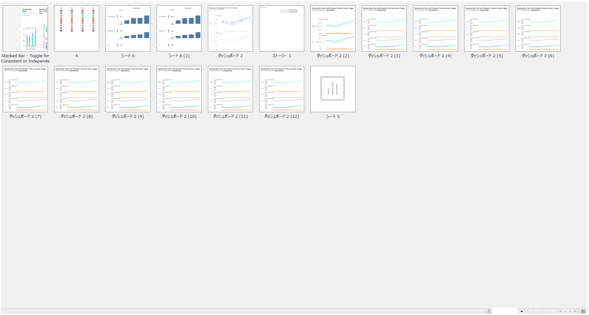
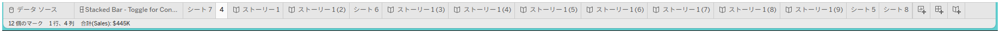

## 機能の違い
シートソーター、フィルムストリップ、タブ表示オプションは、Tableau Desktopでのみ利用可能です。

- **Desktop**: シートソーター、フィルムストリップビュー、タブ表示オプションが利用可能で、ワークブック内のシート間のナビゲーションを効率化できます。
- **Cloud**: これらの高度なシートナビゲーション機能は利用できず、基本的なシートタブのみが表示されます。

## 使用方法
### Tableau Desktop
1. **シートソーター機能**:
   - ワークブック下部のシートタブ領域で右クリックし、「シートソーター」を選択
   - すべてのシートが一覧表示され、ドラッグ&ドロップで順序を変更可能

2. **フィルムストリップビュー**:
   - ワークブック下部のシートタブ領域で右クリックし、「フィルムストリップ」を選択
   - シートのサムネイル表示でビジュアルなナビゲーションが可能

3. **タブ表示オプション**:
   - ワークブック下部のシートタブ領域で右クリックし、表示オプションを選択
   - シートタブの表示方法をカスタマイズ可能

Desktop例:

### Tableau Cloud
1. 基本的なシートタブのみが表示されます
2. シート間の移動は、タブをクリックすることでのみ可能です

Cloud例:

## 使用例・ユースケース
- **大規模ワークブック**: 多数のシートを含むワークブックでの効率的なナビゲーション
- **シート管理**: シートの順序変更や整理作業
- **プレゼンテーション**: フィルムストリップビューでのビジュアルなシート確認

## 注意点・考慮事項
- シートソーター、フィルムストリップ、タブ表示オプションはTableau Desktopの専用機能です
- Tableau Cloudでは基本的なシートタブ機能のみ利用可能です
- 多数のシートを含むワークブックを扱う場合は、Desktop環境での作業を推奨します
- 今後のアップデートでCloud側の機能拡張が予定されている可能性があります

---
参考: [GitHub Issue #63](https://github.com/mickitty0511/tableau-feature-parity/issues/63)