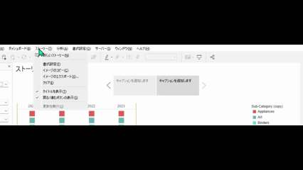
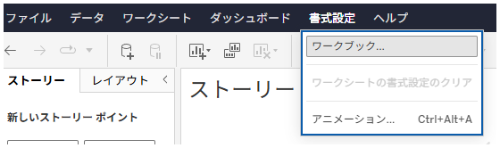

## 機能の違い
ストーリーの戻る/進むボタンの表示/非表示機能は、Tableau Desktopでのみ利用可能です。

- **Desktop**: ストーリーナビゲーションボタン（戻る/進む）の表示/非表示を制御できます
- **Cloud**: ストーリーナビゲーションボタンの表示/非表示設定は利用できません

## 使用方法
### Tableau Desktop
1. ストーリーワークシートを開きます
2. ストーリーパネルまたはメニューから書式設定オプションにアクセスします
3. ナビゲーション設定で戻る/進むボタンの表示/非表示を選択します

Desktop例：

4. 設定を適用するとボタンの表示状態が変更されます

### Tableau Cloud
1. ストーリーワークシートを開きます
2. 基本的なストーリー書式設定のみ利用可能です

Cloud例：

## 使用例・活用シーン
- **プレゼンテーション用途**: ナビゲーションボタンを非表示にしてすっきりとした見た目にする
- **インタラクティブストーリー**: ボタンを表示して読者が自由にナビゲートできるようにする
- **埋め込み用途**: Webページに埋め込む際にボタンの有無を制御する

## 注意事項と考慮点
- この機能はTableau Desktopでのみ利用可能で、Cloudではサポートされていません
- ストーリーを公開する際、Desktopで設定したナビゲーション設定は保持されます
- Cloudでストーリーを編集する場合、この設定を変更することはできません
- 将来的なCloud機能拡張については公式アナウンスをご確認ください

## 参考
[GitHub Issue #64](https://github.com/mickitty0511/tableau-feature-parity/issues/64)