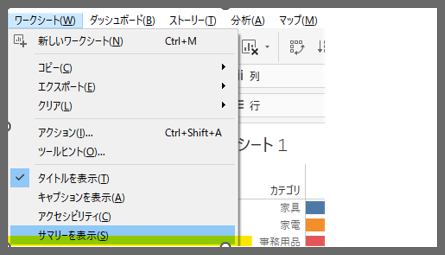
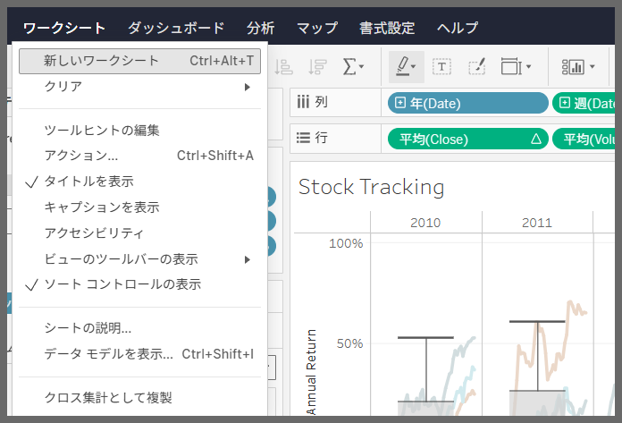

## 機能の違い
サマリの表示機能は、Tableau DesktopとTableau Cloudで利用可能性が異なります。

- **Desktop**: ワークシートのコンテキストメニューからデータの概要を表示するサマリ表示オプションが利用可能
- **Cloud**: サマリ表示機能は利用不可

## 使用方法
### Tableau Desktop
ワークシートのデータに関する詳細な概要情報を簡単に確認できます：

1. ワークシート上で右クリック
2. コンテキストメニューから「サマリの表示」を選択
3. データの統計情報やサマリが表示される

ワークシートのオプションメニューからもアクセス可能：

### Tableau Cloud
Cloud環境では、サマリ表示機能は利用できません。

## 注意事項
- Desktopでは、選択したデータの行数、合計値、平均値などの統計情報を即座に確認できます
- サマリ表示は、データの品質チェックや分析の初期段階で有用です
- Cloudでは、同様の情報を得るには別の分析手法やビューの作成が必要です
- デスクトップ版で作成した分析ワークフローをCloudに移行する際は、サマリ機能の代替手段を検討する必要があります

## 使用例
- データセットの基本統計の確認
- 欠損値や異常値の初期チェック
- フィルタリング後のデータ範囲の確認
- 分析前のデータ理解促進
- レポート作成時の数値検証

---
参考: [GitHub Issue #81](https://github.com/mickitty0511/tableau-feature-parity/issues/81)