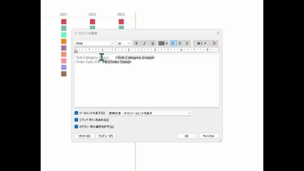
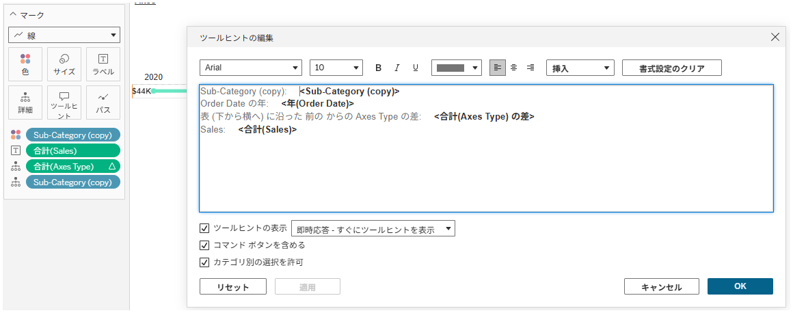

## 機能の違い
フィールド配置用のツールチップにおけるスライダーとルーラー機能は、Tableau Desktopでのみ利用可能です。

- **Desktop**: ツールチップの編集時に、フィールドの配置を調整するためのスライダーとルーラーが利用できます。
- **Cloud**: ツールチップの編集において、スライダーとルーラー機能は利用できません。

## 使用方法
### Tableau Desktopの場合
1. ワークシートでマークカードの「ツールチップ」をクリックします。
2. ツールチップエディターが開きます。
3. フィールドを挿入する際に、スライダーとルーラーを使用して配置を細かく調整できます。
4. スライダーを使用してフィールドの位置を数値で指定できます。
5. ルーラーを使用して視覚的に配置を確認しながら調整できます。

Desktop例:

### Tableau Cloudの場合
1. ワークシートでマークカードの「ツールチップ」をクリックします。
2. ツールチップエディターが開きます。
3. フィールドの挿入は可能ですが、スライダーとルーラーによる精密な配置調整はできません。
4. 基本的なテキスト編集機能のみが利用可能です。

Cloud例:

## 使用例・活用場面
- **レポート作成時**: ツールチップ内の情報を美しく整列させたい場合
- **ダッシュボード設計**: ユーザーエクスペリエンスを向上させるための精密なツールチップレイアウト
- **プレゼンテーション用**: 見栄えの良いツールチップを作成する場合

## 注意点と考慮事項
- この機能はTableau Desktopでのみ利用可能で、運用上重要な機能として分類されています。
- Cloudではスライダーとルーラーが利用できないため、精密なツールチップレイアウトが必要な場合はDesktopでの作業が必要です。
- ワークブックをCloudに公開した後は、ツールチップの微調整ができないため、事前にDesktopで完成させておくことが重要です。
- 将来的にCloudでもこの機能が実装される可能性がありますが、現時点では具体的なスケジュールは未定です。

---
参考: [GitHub Issue #22](https://github.com/mickitty0511/tableau-feature-parity/issues/22)